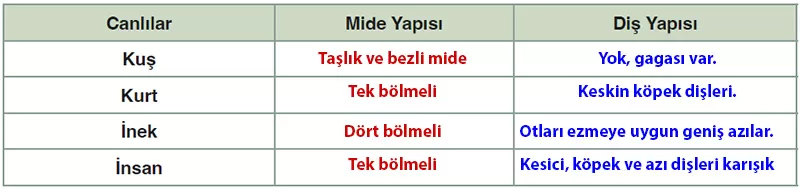

## 10. Sınıf Biyoloji Ders Kitabı Cevapları Meb Yayınları Sayfa 41

Bu farklılıkların yanı sıra tüm omurgalılarda mide benzer özellikler de gösterir. Mide besinlerin geçici olarak depolanmasını, fiziksel (mekanik) ve kimyasal sindirimin yapılmasını sağlar. Mide üst kısmından yemek borusuyla, alt kısmından ince bağırsakla bağlantılıdır. Mide duvarının iç kısmında mukus ve sindirim enzimlerini salgılayan hücrelerin oluşturduğu mukoza tabakası bulunur. Kaslı mide duvarları, besinleri mide öz suyuyla karıştırır. Mide öz suyu HCI (hidroklorik asit), enzim ve mukus salgısı içerir. Besinlerle mideye ulaşan bakteriler, midenin yüksek asidik ortamı sayesinde yok edilir.

**5. Etkinlik**

**Adı**: Sindirim Sistemlerini Karşılaştırma  
 **Amaç**: Canlılarda sindirim çeşitlerini ve yapılarını sınıflandırabilme  
 **Süre**: 40+40 dk.

**Yönerge**

• Aşağıdaki uygulama basamaklarını takip ederek etkinliği gerçekleştiriniz.  
 • Etkinlik sonunda cevaplayacağınız yapılandırılmış grid, öğretmeniniz tarafından Puanlama Anahtarı ile değerlendirilecektir.

**Soru: 1) Sindirim nedir?,  Sindirim nerede ve nasıl gerçekleşir? sorularını cevaplayınız.**

* **Cevap**: Sindirim, besinlerin hücre zarından geçebilecek kadar küçük moleküllere parçalanmasıdır. Ağızda başlar, mide ve ince bağırsakta enzimlerle devam eder, emilim ince bağırsakta gerçekleşir.

**Soru: 2) Bazı omurgalı canlıların ağız, diş yapısı ile sindirim sistemi yapılarına ait aşağıdaki görselleri inceleyiniz (Karekodu okutarak görselleri daha ayrıntılı görebilirsiniz.).**

* **Cevap**: Kuşların dişleri yok, besinleri taşlıkta öğütür. Kurtların keskin dişleri var, mide tek bölmeli. İneklerin dişleri otları ezmeye uygun, mideleri dört bölmeli. İnsanların dişleri farklı besinlere uygun, mide tek bölmeli.

**Soru: 3) Verilen omurgalı canlıların mide ve diş yapılarını karşılaştırarak bulduğunuz sonuçları aşağıdaki tabloya yazınız.**

**10. Sınıf Meb Yayınları Biyoloji Ders Kitabı Sayfa 41**