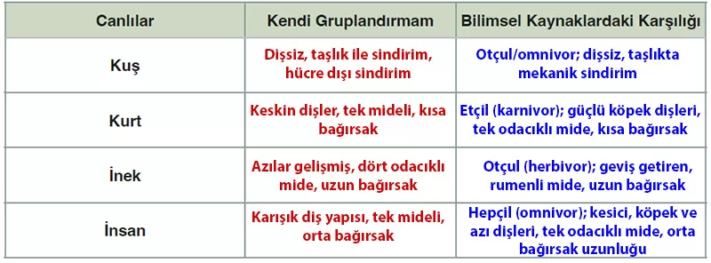

## 10. Sınıf Biyoloji Ders Kitabı Cevapları Meb Yayınları Sayfa 43

**Soru: 10) Kendi gruplandırmalarınızın bilimsel karşılığını bilim dergileri, bilimsel makaleler gibi güvenilir kaynaklardan bulunuz ve bulduğunuz sonuçlarla kendi gruplandırmalarınızı karşılaştırarak ulaştığınız sonuçları aşağıdaki tabloya yazınız.**

**Soru: 11) Canlılardaki sindirim çeşitlerini ve yapılarını isimlendirerek aşağıda boş bırakılan alana yazınız.**

**Kuş:** Hücre dışı sindirim, taşlık ve bezli mide ile mekanik ve kimyasal sindirim

**Kurt:** Hücre dışı sindirim, etçil sindirim sistemi, tek odacıklı mide

**İnek:** Hücre dışı sindirim, otçul sindirim sistemi, dört odacıklı mide (işkembe, börkenek, kırkbayır, şirden)

**İnsan:** Hücre dışı sindirim, hepçil sindirim sistemi, tek odacıklı mide

**Soru: 12) Yaptığınız gruplandırmaları poster, model ya da uygun web araçlarını kullanarak ve yaratıcılığınızı ortaya koyarak farklı metotlarla sununuz.**

Poster ya da model hazırlarken:

Kuş için taşlık modeli,

Kurt için diş maketi,

İnek için dört bölmeli mide şeması,

İnsan için diş çeşitlerini ve mide-bağırsak düzenini gösteren çizim kullanılabilir.

Web araçlarıyla (ör. Canva, Padlet) tablo, kavram haritası veya sindirim sistemi akış diyagramı hazırlanabilir.

**Soru: Aşağıdaki yapılandırılmış gridde kuş, kurt, inek ve insandaki sindirim çeşitleri ile sindirimde görevli yapıların özellikleri verilmiştir. Kutucuk numaralarını kullanarak soruları cevaplayınız (Aynı numaraları bir veya birden fazla sorunun cevabı olarak kullanabilirsiniz.).**

**Soru: a) Hangisi/hangileri insan ve inekte ortak olarak bulunur?**

**Soru: b) Hangisi/hangileri sadece inekte bulunur?**

**Soru: c) Hangi yapılar beslenme şekline göre farklılık gösterebilir?**

* **Cevap**: 2, 5, 7, 8, 9, 10, 11

**Soru: ç) Hangi sindirim çeşidi sayesinde doğada çürüme/kokuşma gerçekleşir?**

**Soru: d) Hangileri kuş, kurt, inek ve insanda ortak olarak bulunur?**

**10. Sınıf Meb Yayınları Biyoloji Ders Kitabı Sayfa 43**