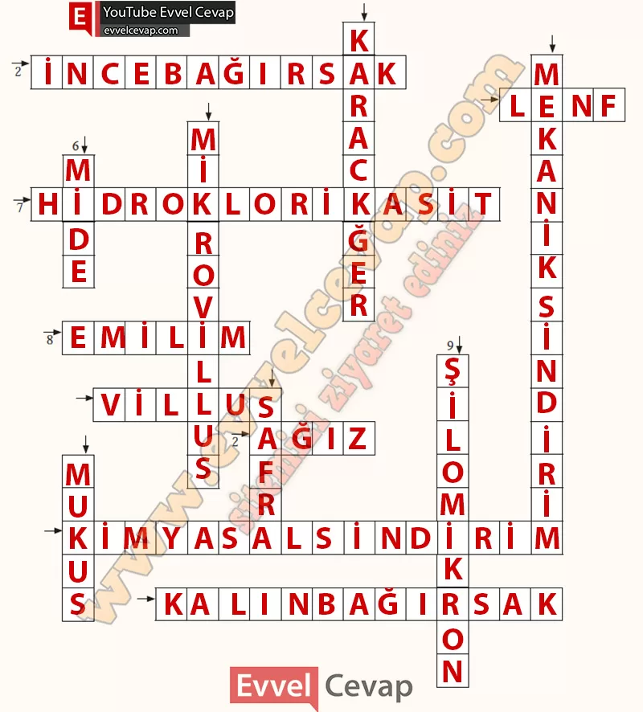

## 10. Sınıf Biyoloji Ders Kitabı Cevapları Meb Yayınları Sayfa 55

veya farklı besin gruplarıyla alınması gerekebilir. Bu nedenle ilaçları doktorun önerdiği şekilde kullanmak önemlidir.

**Besinlerden Enerji Elde Etme Yolları**  
 Karbohidrat, yağ, protein gibi moleküllerin sindirimi, emilimi ve taşınması vücudun sağlıklı bir şekilde çalışabilmesi için önemlidir. Çünkü hücrelerdeki meta- bolik faaliyetler için gereken enerji, organik besinlerden elde edilir. İnsanlarda beslenme yoluyla vücuda alınan besinler, sindirim sisteminde daha küçük bileşenlere ayrılarak dolaşım sistemi aracılığıyla hücrelere taşınır. Hücrelerde bu besin maddeleri farklı biyokimyasal süreçlerde kullanılır. Bu süreçlerden biri de hücresel solunum ile ATP üretimidir. Üretilen ATP, hücrelerde gerçekleşen metabolik olaylarda kullanılır.

**Kontrol Noktası**

**Soru: Aşağıdaki soruların cevaplarını ilgili yere yazarak bulmacayı tamamlayınız.**

**Soldan Sağa**

2. İnsan vücudunda yağların sindiriminin başlayıp tamamlandığı yer. **(İnce bağırsak)**  
 4. Yağlar ve yağda eriyen vitaminlerin sindirimden sonra, kan dolaşımına katılmadan önce taşınma yolu. **(Lenf)**  
 7. Mide öz suyu içinde bulunan, ortamın pH değerini düşürdüğü için proteinlerin denatürasyonuna sebep olan kuvvetli asit. **(Hidroklorikasit)**  
 8. Sindirilen besinlerin ince bağırsaktan dolaşım sistemine geçmesi. **(Emilim)**  
 10. İnce bağırsağın iç duvarlarında bulunan ve yüzey alanını artıran küçük çıkıntılar. **(Villus)**  
 12. İnsan vücudunda karbohidratlarm sindirime uğradığı ilk yer. **(Ağız)**  
 14. Besinlerdeki büyük moleküllerin enzimler yardımıyla yapı taşlarına ayrılmasını sağlayan sindirim çeşidi. **(Kimyasal sindirim)**  
 15. B ve K vitaminlerinin üretilip emiliminin gerçekleştiği yer. **(Kalın bağırsak)**

**Yukarıdan Aşağıya**

1. Emilmiş besin maddelerinin vücuda dağılmadan önce birtakım değişikliklere uğratıldığı organ. **(Karaciğer)**  
 3. Besinlerin fiziksel olarak küçük parçalara ayrılması. **(Mekanik sindirim)**  
 5. Villusları oluşturan epitel hücrelerde bulunan sitoplazmik uzantılar. **(Mikrovillus)**  
 6. İnsan vücudunda proteinlerin sindiriminin başladığı yer. **(Mide)**  
 9. İnce bağırsak epitel hücrelerinde protein ve kolesterolle kaplanan trigliseritlerin oluşturduğu yapı. **(Şilomikron)**  
 11. Karaciğer tarafından üretilen ve yağların daha küçük yağ damlacıklarına dönüşmesini sağlayan sıvı. **(Safra)**  
 13. Midenin iç yüzeyini örten epitel hücrelerinin salgıladığı ve kendilerinin sindirilmesini engellediği salgı. **(Mukus)**

**10. Sınıf Meb Yayınları Biyoloji Ders Kitabı Sayfa 55**