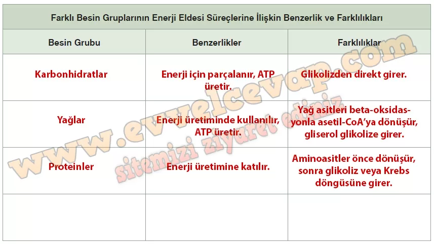

## 10. Sınıf Biyoloji Ders Kitabı Cevapları Meb Yayınları Sayfa 64

**8. Etkinlik**

**Yönerge**

• Aşağıdaki uygulama basamaklarını takip ederek etkinliği gerçekleştiriniz.  
 • Etkinlik sonunda cevaplayacağınız yapılandırılmış grid, öğretmeniniz tarafından Puanlama Anahtarı ile değerlendirilecektir

**Soru: 1) Farklı besin gruplarından enerji eldesi süreçleriyle ilgili;**

**Soru:  Besinlerin oksijenli solunumun hangi basamağında tepkimeye gireceği, içeriğinde bulunan organik bileşiğin karbon sayısına mı bağlıdır?**

* **Cevap**: Besinlerin hangi basamakta tepkimeye gireceği, sahip oldukları karbon sayısına bağlıdır.

**Soru: Farklı besinlerin yapı taşları, hücresel solunum tepkimelerine aynı basamaktan katılabilir mi?**

* **Cevap**: Evet, farklı besinlerin yapı taşları aynı basamaktan hücresel solunuma katılabilir.

**Soru: Hücresel solunumda kullanılan her besin Krebs döngüsüne girer mi?**

* **Cevap**: Hayır, her besin doğrudan Krebs döngüsüne girmez; bazıları önce glikoliz veya başka dönüşümlerden geçer.

**Soru: 2) Topladığınız bilgileri sınıf arkadaşlarınızla tartışarak farklı besin gruplarının hücresel solunumun hangi basamağında hücresel solunuma dâhil olduğunu ve bu besin gruplarının enerji eldesi süreçlerine ilişkin özelliklerini belirleyiniz.**

* **Cevap**: Karbonhidratlar glikolizden, yağlar yağ asitlerinin beta-oksidasyonu ve gliserolün glikolize girmesiyle, proteinler ise aminoasitlerin dönüştürülmesiyle hücresel solunuma katılır. Hepsi sonunda ATP üretmek için mitokondriye ulaşır.

**Soru: 3) Elde ettiğiniz bilgilerin özetini oluşturunuz ve bu özeti kullanarak farklı besin gruplarının enerji eldesi süreçlerine ilişkin benzerlik ve farklılıklarını aşağıdaki tabloya listeleyiniz.**

**Soru: 4) Farklı besin gruplarından enerji elde edilme süreçlerini karşılaştırabilmek için uygun web araçlarıyla yaratıcılığınızı kullanarak bir sunum hazırlayınız ve hazırladığınız sunumu sınıfta arkadaşlarınıza sununuz.**

**FARKLI BESİNLERDEN ENERJİ ELDESİ**

**1. Karbonhidratlar**

* Glikolizden hücresel solunuma katılır.
* Hızlı enerji kaynağıdır.
* Glikoz → Piruvat → Krebs Döngüsü → ETS → ATP

**2. Yağlar**

* Yağ asitleri **beta-oksidasyon** ile asetil-CoA’ya dönüşür.
* Gliserol glikolize katılır.
* Karbonhidratlardan daha fazla enerji üretir.

**3. Proteinler**

* Aminoasitler önce dönüştürülür.
* Karbon sayılarına göre glikoliz, piruvat ya da Krebs’e girer.
* Enerji verir ama öncelikli kaynak değildir.

**4. Benzerlikler**

* Hepsi ATP üretir.
* Son ürünleri CO₂, H₂O ve ısıdır.

**5. Farklılıklar**

* Hücresel solunuma giriş basamakları farklıdır.
* Enerji miktarları farklıdır (yağ > karbonhidrat > protein).

**10. Sınıf Meb Yayınları Biyoloji Ders Kitabı Sayfa 64**