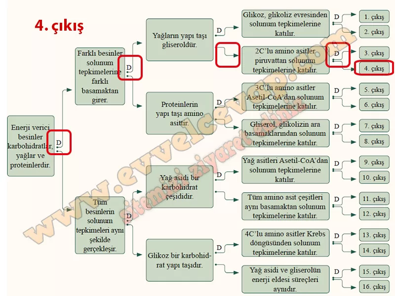

## 10. Sınıf Biyoloji Ders Kitabı Cevapları Meb Yayınları Sayfa 66

• Karbohidrat yapı taşı olan glikoz, glikoliz evresinden solunum tepkimelerine girerek piruvata kadar parçalanır. Piruvat, Asetil-CoA’ya dönüşür; Krebs ve ETS evrelerinden geçer.  
 • Yağların sindirim ürünleri, yağ asitleri ve gliseroldür. Yağ asitleri Ase- til-CoA’ya dönüştürüldükten sonra Krebs döngüsüne girerek solunum tepkimelerine katılır. Gliserol (3C) ise glikolizin ara basamaklarından tepkimeye girer.

• Proteinler sindirildikten sonra yapı taşları olan amino asitler oluşur. Amino asitler solunum tepkimelerine katılmadan önce yapılarında bulunan amino grubu uzaklaştırılır. Daha sonra karbon sayılarına göre 2 karbonlu amino asitler AsetibCoA’dan, 3 karbonlu amino asitler piruvattan, 4 ve daha fazla karbonlu amino asitler ise Krebs döngüsünden tepkimeye girer.

Karbohidrat, yağ ve proteinlerin hücresel solunum tepkimeleri sonucunda ortak olarak C02, H20, ATP ve ısı açığa çıkar. Ancak amino asitlerin yıkımı sırasında bu ürünlere ek olarak azot içeren atık maddeler de oluşur.

**Soru: Aşağıda birbiri ile bağlantılı, doğru/yanlış ifadeler içeren tanılayıcı dallanmış ağaç verilmiştir. Soldaki ilk ifadeden başlayarak, söz konusu ifadelerin doğru (D) ya da yanlış (Y) olduğuna karar vererek ilerleyiniz. Sonuçta ulaştığınız çıkışı işaretleyiniz. Tek bir çıkışı işaretleyebileceğinizi unutmayınız.**

**10. Sınıf Meb Yayınları Biyoloji Ders Kitabı Sayfa 66**