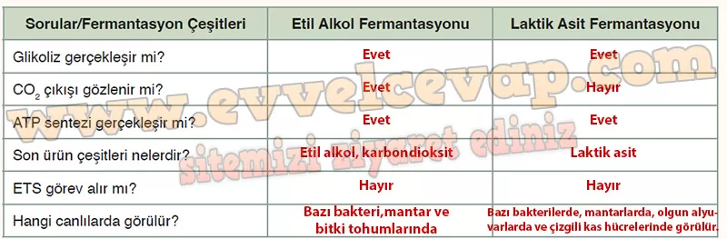

## 10. Sınıf Biyoloji Ders Kitabı Cevapları Meb Yayınları Sayfa 70

**Laktik Asit Fermantasyonu**

Laktik asit fermantasyonu glikoliz sonucu oluşan piruvatın enzim varlığında laktik aside dönüştürülmesidir. Glikoliz reaksiyonu sonucunda 2 NADH, 2 ATP ve 2 piruvat molekülü oluşur. Piruvatlar, 2 NADH molekülünün hidrojenlerini alarak doğrudan son ürün olan laktik aside dönüşür. Bu sırada yeniden NAD+ oluşturularak glikolizin devamı sağlanır (Görsel Laktik asit fermantasyonunda C02 çıkışı görülmez. Laktik asit fermantasyonu aşağıdaki şekilde ifade edilebilir:

Laktik asit fermantasyonu; bazı bakterilerde, bazı mantarlarda, memelilerin olgun alyuvar hücrelerinde ve omurgalıların çizgili kas hücrelerinde görülür. Endüstride peynir, yoğurt ve turşu üretiminde kullanılır. İnsanlarda çizgili kas hücrelerine yeterli oksijen gelmediği durumlarda laktik asit fermantasyonu ile ATP üretilir. Yoğun kas aktivitesinin başlangıcında ATP üretmek için glikoz yıkım hızı, kasın kandan oksijen alma hızını aşar. Bu koşullarda hücrelerde oksijenli solunum ve fermantasyon birlikte gerçekleştirilir. Bu durumda oksijenli solunuma devam edilirken çizgili kaslarda laktik asit fermantasyonu ile gerekli olan enerji üretilir. Bu sayede ani bir performans sonrasında ortamda oksijen olsa bile hızlı ancak enerji olarak verimsiz ATP üretimi sağlanır. Yeterli oksijen sağlandığında üretilen az miktardaki laktik asitle kasların daha iyi çalışması sağlanır. Bunun için yoğun kas egzersizlerinden önce yapılan ısınma hareketleri oldukça faydalıdır.

**Kontrol Noktası**

**Soru: Aşağıdaki tabloda fermantasyon ile ilgili sorular verilmiştir. Soruların cevaplarını etil alkol ve laktik asit fermantasyonuna ait boş kutulara yazınız.**

**10. Sınıf Meb Yayınları Biyoloji Ders Kitabı Sayfa 70**