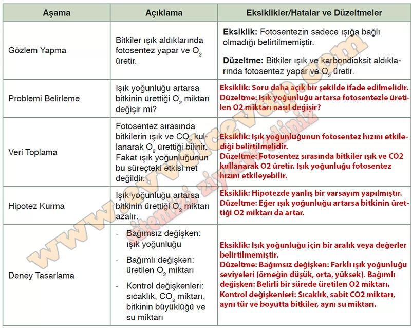

## 10. Sınıf Biyoloji Ders Kitabı Cevapları Meb Yayınları Sayfa 93

**Soru: 57-60. soruları aşağıda verilen metin ve tablodan yararlanarak cevaplayınız.**

Bir grup öğrenci fotosentezin verimliliğini etkileyen faktörleri incelemek amacıyla bir deney tasarlamıştır. Deneyin amacı, ışık yoğunluğundaki değişikliklerin fotosentez sürecine etkisini anlamaktır. Bu kapsamda öğrenciler şu soruyu oluşturmuşlardır:  
 Deney Sorusu: Işık yoğunluğu arttıkça fotosentezle üretilen oksijen miktarı nasıl değişir?  
 Hazırlık sürecinde öğrenciler, deneyin uygulanabilirliğini göstermek için takip edecekleri bilimsel yöntem basamaklarını ve açıklamalarını içeren bir tablo düzenlemişlerdir.

**Soru: 57) Aşağıda öğrencilerin deney tasarımı için hazırladıkları tablo verilmiştir. Tablodaki bazı aşamaların açıklamaları eksik veya hatalıdır. Eksik ve hataları belirleyerek düzeltmelerinizi uygun boşluklara yazınız.**

**Soru: 58) Deneyin hipotezi oluşturulurken göz önünde bulundurulması gereken en önemli değişken nedir?**

* **Cevap**: Işık yoğunluğudur çünkü fotosentez sürecini etkileyen temel faktördür.

**10. Sınıf Meb Yayınları Biyoloji Ders Kitabı Sayfa 93**