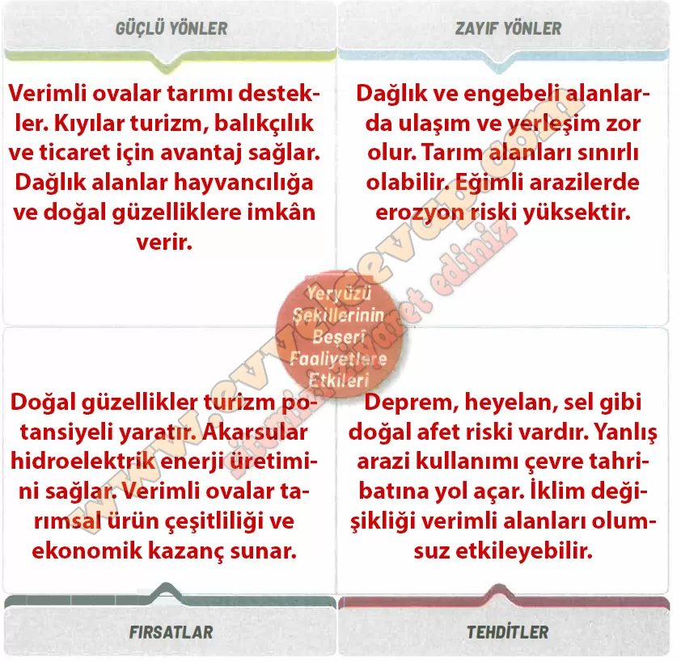

## 10. Sınıf Coğrafya Ders Kitabı Cevapları Meb Yayınları Sayfa 103

**Soru: Yaşadığınız yerdeki yeryüzü şekillerinin beşerî faaliyetlere olan etkilerini GZFT analiz tekniğine göre çözümleyiniz.**

**Soru: Yaşadığınız yerdeki yeryüzü şekillerine bağlı ortaya çıkan beşerî faaliyetler sırasında doğal çevrenin korunması için farkındalık oluşturmaya yönelik sloganlar yazarak arkadaşlarınızla paylaşınız.**

* **Cevap**: Doğayı koru, geleceğini yaşat! · Yeryüzü şekilleri mirasımızdır, sahip çıkalım! · Doğal güzelliklerimizi tüketme, gelecek nesillere ilet! · İnsan yaşar, doğa yaşarsa!

**10. Sınıf Meb Yayınları Coğrafya Ders Kitabı Sayfa 103**