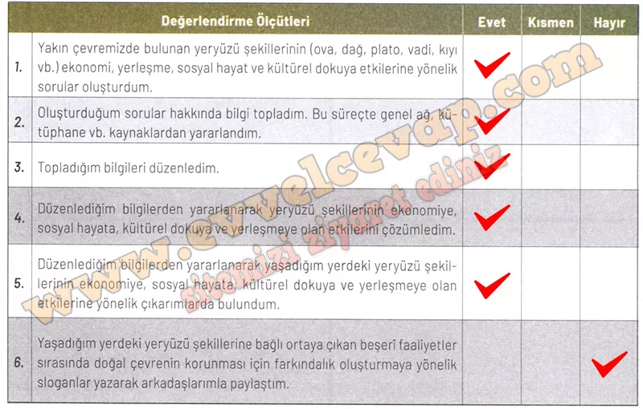

## 10. Sınıf Coğrafya Ders Kitabı Cevapları Meb Yayınları Sayfa 104

**Soru: Aşağıda verilen ölçütler, kendi çalışmanız hakkında belirlemeler yapmanız için düzenlenmiştir. Çalışmanızla ilgili ifadeler size uygunsa ”Evet”i, biraz uygunsa “Kısmen”i, uygun değilse “Hayır”ı işaretleyiniz. Tüm ifadeleri işaretlemeyi unutmayınız**

**Soru: Çalışmanız hakkındaki görüşlerinizi yazınız.**

**✅Çalışmam sırasında öğrendiğim bilgiler**: Yeryüzü şekillerinin tarım, ulaşım, turizm ve yerleşme üzerinde büyük etkileri olduğunu öğrendim.

**✅Çalışmam sırasında zorlandığım yerler**: Topladığım bilgileri düzenleyip özetlerken biraz zorlandım.

**✅Çalışmamı yeniden yapacak olsaydım dikkat edeceğim hususlar**: Daha fazla kaynaktan yararlanır, gözlemlerimi daha ayrıntılı not ederdim.

**Soru: Çalışmalarınızı verimli bir şekilde sürdürebilmeniz için “Hayır” ve “Kısmen” seçeneklerini işaretlediğiniz konular ile çalışma sırasında zorlandığınız öğrenmeleri tekrar ediniz. ihtiyaç duyduğunuz konularda öğretmeninizden destek alarak eksiklerinizi tamamlayınız.**

* **Cevap**: Çalışmalarımı daha verimli sürdürebilmek için “Kısmen” işaretlediğim slogan yazma ve paylaşma kısmını tekrar etmeli, eksiklerimi öğretmenimin desteğiyle tamamlamalıyım.

**10. Sınıf Meb Yayınları Coğrafya Ders Kitabı Sayfa 104**