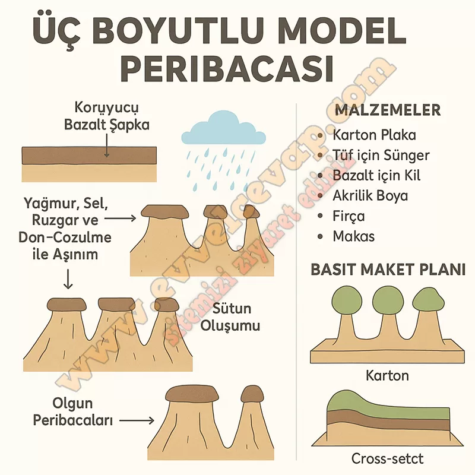

## 10. Sınıf Coğrafya Ders Kitabı Cevapları Meb Yayınları Sayfa 105

**Gelecek Derse Hazırlık**

**Soru: 1) Çalışmanızı grup hâlinde planlayınız.**

* **Cevap**: Çalışmamızı grup hâlinde planlayarak görev dağılımı yapacağız.

**Soru: 2) Öğretmen rehberliğinde heterojen gruplar oluşturunuz.**

* **Cevap**: Öğretmenimizin yönlendirmesiyle farklı özelliklere sahip öğrencilerden heterojen gruplar oluşturacağız.

**Soru: 3) Grup arkadaşlarınızla üç boyutlu model çalışması yapmak istediğiniz yeryüzü şeklini belirleyiniz.**

* **Cevap**: Grup olarak üç boyutlu modelini yapmak için **peribacası** yeryüzü şeklini seçtik.

**Soru: 4) Belirlediğiniz yeryüzü şekli hakkında bilgi toplayınız. Bu süreçte genel ağ, kütüphane vb. kaynaklardan yararlanabilirsiniz.**

* **Cevap**: Peribacalarının oluşum süreci, bulunduğu bölgeler ve turizm açısından önemi hakkında bilgi toplayacağız.

**Soru: 5) Topladığınız bilgileri yapacağınız üç boyutlu model çalışmanız doğrultusunda çözümleyiniz.**

* **Cevap**: Topladığımız bilgileri peribacasının aşınım ve birikim süreçlerine bağlı olarak nasıl şekillendiğini gösterecek şekilde düzenleyeceğiz.

**Soru: 6) Üç boyutlu model çalışması için gerekli malzemeleri belirleyip temin ediniz.**

* **Cevap**: Model için karton, kil hamuru, maket bıçağı, boya, yapıştırıcı ve mukavva gibi malzemeleri belirleyip temin edeceğiz.

**Performans Çalışması**

**Beceri**: Kendini Düzenleme (Öz Düzenleme), Kendine Uyarlama (Öz Yansıtma)

**Soru: Sizden istenen üç boyutlu model oluşturma çalışması için aşağıdaki işlem adımlarını uygulayınız.**

* **Cevap**: Üç boyutlu model için önce konumuzu belirledik (ör. peribacası), ardından gerekli malzemeleri hazırladık. Topladığımız bilgileri modelin nasıl şekilleneceğine göre düzenledik ve grup hâlinde modelimizi oluşturduk.

**Soru: Yaptığınız üç boyutlu modeli grup arkadaşlarınızla sınıf ortamında sununuz.**

* **Cevap**: Modelimizi sınıfta grup arkadaşlarımızla sunduk. Peribacalarının nasıl oluştuğunu, hangi süreçlerin etkili olduğunu ve Türkiye’deki örneklerini anlattık.

**Soru: Çalışma, analitik dereceli puanlama anahtarı ve öz değerlendirme formuyla değerlendirilecektir. Analitik dereceli puanlama anahtarı ölçütleri; hazırlık yapma, bilgi toplama, bilgileri çözümleme, model oluşturma ve sunum yapmadır.**

* **Cevap**: Çalışma hazırlanırken hazırlık yapma, bilgi toplama, bilgileri çözümleme, model oluşturma ve sunum yapma ölçütlerine göre değerlendirilecektir. Biz de bu ölçütleri dikkate alarak çalışmamızı tamamladık.

**10. Sınıf Meb Yayınları Coğrafya Ders Kitabı Sayfa 105**