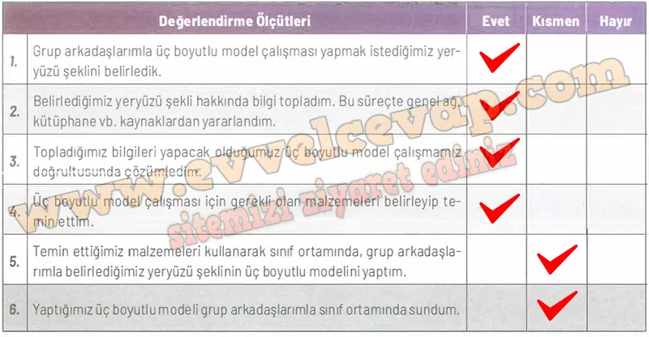

## 10. Sınıf Coğrafya Ders Kitabı Cevapları Meb Yayınları Sayfa 107

**Soru: Aşağıda verilen ölçütler, kendi çalışmanız hakkında belirlemeler yapmanız için düzenlenmiştir. Çalışmanızla ilgili ifadeler size uygunsa “Evet”i, biraz uygunsa “Kısmen”i, uygun değilse “Hayır”! işaretleyiniz. Tüm ifadeleri işaretlemeyi unutmayınız.**

**Soru: Çalışmanız hakkındaki görüşlerinizi yazınız.**

**✅Çalışmam sırasında öğrendiğim bilgiler**: Yeryüzü şekillerinin oluşumunda aşınım ve birikim süreçlerinin etkili olduğunu ve model yaparak bunları somutlaştırabileceğimizi öğrendim.

**✅Çalışmam sırasında zorlandığım yerler**: Malzemeleri kullanırken modeli şekillendirmekte ve grupta iş bölümü yaparken zorlandım.

**✅Çalışmamı yeniden yapacak olsaydım dikkat edeceğim hususlar**: Daha planlı çalışır, malzemeleri önceden hazırlar ve modelin sunumunu daha düzenli yapmaya dikkat ederdim.

**Soru: Çalışmalarınızı verimli bir şekilde sürdürebilmeniz için “Hayır” ve “Kısmen” seçeneklerini işaretlediğiniz konular ile çalışma sırasında zorlandığınız öğrenmeleri tekrar ediniz. İhtiyaç duyduğunuz konularda öğretmeninizden destek alarak eksiklerinizi tamamlayınız.**

* **Cevap**: “Kısmen” işaretlediğim konularda tekrar çalışmalı, özellikle model yapımını pekiştirmeliyim. Eksik kaldığım yerlerde öğretmenimden destek alarak süreci daha verimli hâle getirmeliyim.

**10. Sınıf Meb Yayınları Coğrafya Ders Kitabı Sayfa 107**