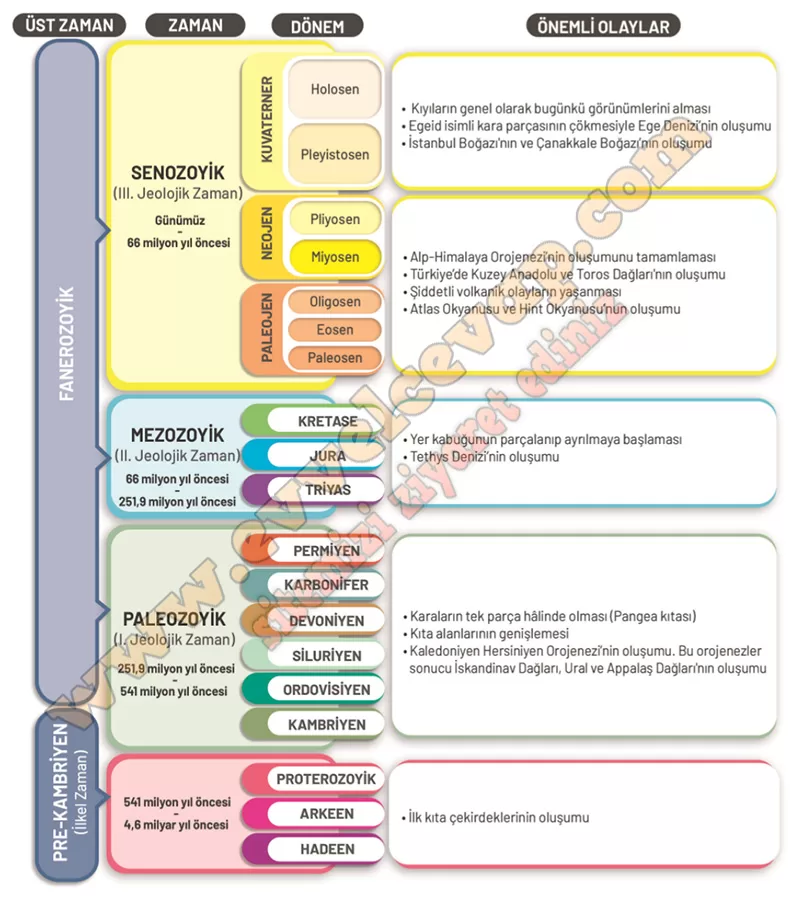

## 10. Sınıf Coğrafya Ders Kitabı Cevapları Meb Yayınları Sayfa 112

**Soru: 12 ve 13. soruları aşağıda verilen jeolojik zaman çizelgesine göre cevaplayınız.**

**Soru: 12) Tektonizmaya bağlı gerçekleşen başlıca olayları, jeolojik zaman çizelgesindeki önemli olaylar başlığı altında bulunan boş alanlara yazınız.**

**Soru: 13) Türkiye arazisinin oluşum sürecinde yaşanan değişimi, jeolojik süreçlerde Türkiye arazisinde yaşanan olaylardan yararlanarak açıklayınız.**

* **Cevap**: Türkiye arazisi jeolojik süreçlerde levha hareketlerinin etkisiyle sürekli değişmiştir. Paleozoik’te masif alanlar oluşmuş, Mezozoik’te Tethys Denizi’nin varlığı görülmüştür. Tersiyer’de Alp-Himalaya Orojenezi ile Anadolu’nun bugünkü dağ kuşakları yükselmiş, volkanik faaliyetler ve faylanmalar yaşanmıştır. Kuaterner’de ise depremler, grabenler, genç volkanlar, akarsu ve buzulların aşındırma-birikim faaliyetleriyle Türkiye’nin bugünkü yer şekilleri ortaya çıkmıştır.

**10. Sınıf Meb Yayınları Coğrafya Ders Kitabı Sayfa 112**