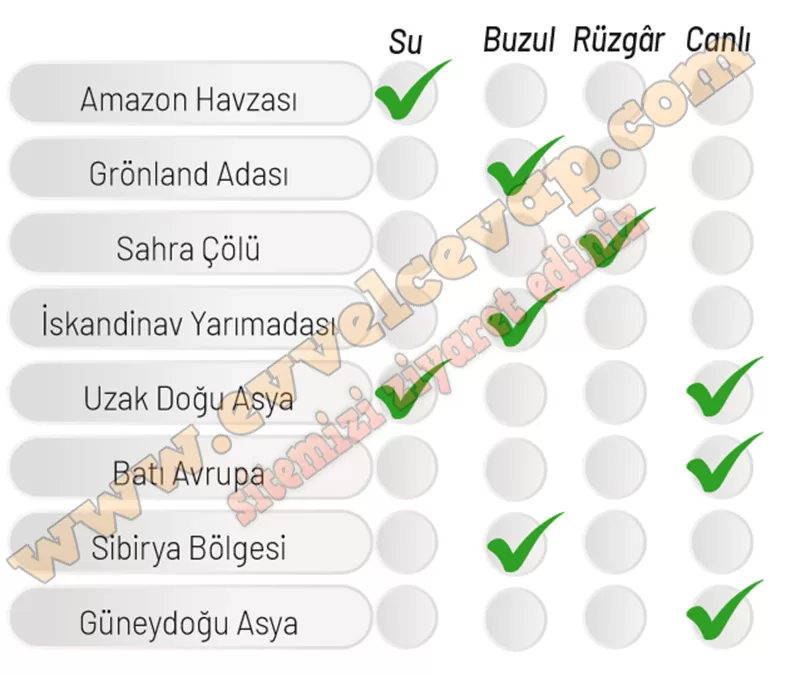

## 10. Sınıf Coğrafya Ders Kitabı Cevapları Meb Yayınları Sayfa 114

**Soru: 17 ve 18. soruları aşağıda verilen kavram şemasındaki sınıflandırmaya göre cevaplayınız**

Kayaçların ayrışmasıyla arazi üzerinde oluşan döküntü örtüleri ve blokları, toprak gibi malzemeler; sular (yağmur damlaları, sel, akarsu, yer altı suyu, dalga ve akıntılar, buzullar) ve rüzgârlar gibi dış etkenler tarafından aşındırılmaktadır. Aşındırılarak taşınan malzemeler de çökelmeye uygun yerlerde birikmektedir. Aşınma ve birikme süreçlerinde etkili olan dış etkenler aşağıdaki kavram şemasında gösterilmiştir.

**Soru: 17) Aşağıdaki alanlarda arazinin şekillenmesinde etkili olan başlıca dış etkenlerin neler olduğunu belirleyip alanların karşısında verilen ilgili dış etkenleri işaretleyiniz.**

**Soru: 18) İşaretlediğiniz dış etkenlerin ilgili alanın şekillenmesinde başlıca dış etkenler olmasının nedenlerini boş bırakılan alanlara kısaca yazınız.**

**✅Amazon Havzası (Su):** Yoğun yağış ve akarsuların etkisiyle aşınım ve birikim süreçleri güçlüdür.

**✅Grönland Adası (Buzul):** Soğuk iklim nedeniyle buzulların aşındırma ve biriktirme faaliyetleri etkilidir.

**✅Sahra Çölü (Rüzgâr):** Kurak iklim ve bitki örtüsü azlığı sebebiyle rüzgâr aşındırması ve biriktirmesi etkilidir.

**✅İskandinav Yarımadası (Buzul):** Buzulların aşındırma faaliyetleriyle fiyordlar ve buzul vadileri oluşmuştur.

**✅Uzak Doğu Asya (Su + Canlı):** Muson yağışlarıyla su aşındırması etkilidir; yoğun nüfus ve tarım canlı faktörünü artırır.

**✅Batı Avrupa (Canlı):** Yoğun nüfus, tarım, sanayi ve şehirleşme doğal çevreyi şekillendirmiştir.

**✅Sibirya Bölgesi (Buzul):** Soğuk iklim ve donma-çözülme süreçleri araziyi şekillendirmektedir.

**✅Güneydoğu Asya (Canlı):** Tarım (pirinç tarlaları), ormansızlaşma ve yoğun nüfus arazinin şekillenmesinde etkili olmuştur.

**10. Sınıf Meb Yayınları Coğrafya Ders Kitabı Sayfa 114**