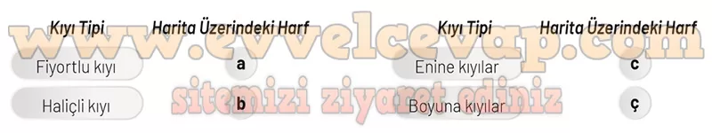

## 10. Sınıf Coğrafya Ders Kitabı Cevapları Meb Yayınları Sayfa 115

**Soru: 19 ve 20. soruları aşağıda verilen görsele göre cevaplayınız.**

**Soru: 19) Aşağıdaki kıyı tiplerini harita üzerinde harfler ile gösterilen kıyı tipleri ile eşleştiriniz.**

**Soru: 20) Aşağıdaki kıyı tiplerinin haritadaki görüldüğü yerlerin coğrafi özellikleri de dikkate alındığında, alanın hangi doğal özellikleri bu kıyı tiplerinin oluşumunda belirleyici bir faktör olmuştur? Yazınız.**

**Faktörler**:

**➡️Fiyortlu kıyı:** Buzulların aşındırdığı derin vadilerin deniz suları altında kalmasıyla oluşur (Norveç kıyıları).

**➡️Haliçli kıyı:** Gelgit etkisinin güçlü olduğu bölgelerde akarsu ağızlarının sular altında kalmasıyla oluşur (Manş kıyıları).

**➡️Enine kıyılar:** Dağların denize dik uzandığı yerlerde akarsuların vadilerinin deniz tarafından sular altında kalmasıyla oluşur (Batı Anadolu kıyıları).

**➡️Boyuna kıyılar:** Dağların denize paralel uzanması nedeniyle kıyının girinti-çıkıntısının az, doğal limanların sınırlı olmasıyla oluşur (Kuzeybatı Anadolu kıyıları).

**10. Sınıf Meb Yayınları Coğrafya Ders Kitabı Sayfa 115**