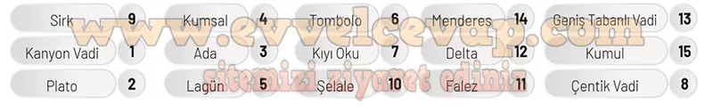
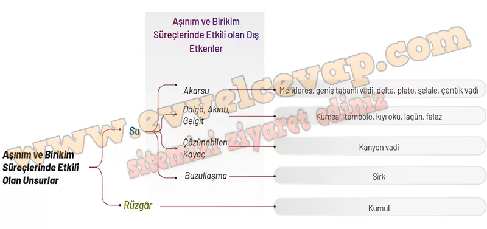

## 10. Sınıf Coğrafya Ders Kitabı Cevapları Meb Yayınları Sayfa 116

**Soru: 21 ve 22. soruları aşağıda verilen görseldeki numaralanmış alanlara göre cevaplayınız.**

**Soru: 21) Aşınım ve birikim süreçlerinin etkisiyle oluşan, aşağıda verilen yer şekillerini görseldeki numaralanmış alanlarla eşleştiriniz.**

**Soru: 22) Eşleştirdiğiniz yer şekillerinin aşınım ve birikim süreçlerinde etkili olan unsurlardan hangisinin etkisiyle oluştuğunu kavram şemasına yazarak eşleştiriniz.**

**10. Sınıf Meb Yayınları Coğrafya Ders Kitabı Sayfa 116**