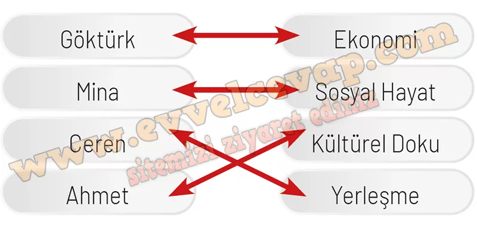

## 10. Sınıf Coğrafya Ders Kitabı Cevapları Meb Yayınları Sayfa 117

**Soru: 23 -25. soruları aşağıda verilen öğrenci önermelerinden yararlanarak cevaplayınız.**

Coğrafya öğretmeni derste yeryüzü şekilleriyle beşeri faaliyetler arasındaki etkileşimin öğrenciler tarafından sorgulanabilmesi için Göktürk, Mina, Ceren ve Ahmet’ten bu bağlamda önermelerde bulunmalarını istemiştir. Öğrencilerin önermeleri aşağıda verilmiştir.

➡️Yer şekilleri bir bölgedeki ekonomik faaliyetlerin çeşitliliğini belirleyen en önemli etkenlerdendir.  
 ➡️İnsan topluluklarının yaşam tarzının şekillenmesinde coğrafi koşullar belirleyici bir faktördür.  
 ➡️Tarım için ideal koşullar sunan verimli ovalar ve nehir vadileri yoğun nüfuslu yerleşmelerin gelişmesine olanak sağlar.  
 ➡️İnsan topluluklarının geleneklerinin ve kültürel değerlerinin ortaya çıkmasında, şekillenmesinde coğrafi koşullar şekillendirici bir unsurdur.

**Soru: 23) Öğrencilerin yeryüzü şekilleriyle beşeri faaliyetler arasındaki etkileşime yönelik ortaya koydukları önermeler sınıflandırılmak istenirse hangi öğrencinin yeryüzü şekillerinin ekonomiye, sosyal hayata, kültürel dokuya ve yerleşmeye olan etkilerine yönelik önermede bulunduğunu belirleyip oklar çizerek eşleştiriniz.**

**Soru: 24) Öğrencilerin önermelerinden hareketle, yeryüzü şekillerinin ekonomiye, sosyal hayata, kültürel dokuya ve yerleşmeye olan etkilerine yönelik aşağıdaki alana Türkiye’den örnekler yazınız.**

**✅Ekonomi:** Çukurova Ovası’nda pamuk, mısır ve narenciye tarımı; Ege’de zeytin ve üzüm üretimi.

**✅Sosyal hayat:** Karadeniz’de dağlık alanlar yaylacılık kültürünü ve yayla şenliklerini geliştirmiştir.

**✅Kültürel doku:** Kapadokya’daki peribacaları ve yer altı şehirleri turizm ve kültürel miras açısından önemlidir.

**✅Yerleşme:** Verimli topraklara sahip Bursa Ovası ve Konya Ovası gibi alanlarda yoğun nüfuslu yerleşmeler gelişmiştir.

**Soru: 25) Türkiye’de yeryüzü şekillerinin beşerî faaliyetlere olan etkilerinin olumlu ve olumsuz yönleri hakkındaki görüşlerinizi aşağıdaki alana yazınız.**

* **Cevap**: Türkiye’de ovalar tarım ve yerleşme için olumlu koşullar sunar. Dağlık ve engebeli alanlar ulaşımı zorlaştırarak olumsuz etki yapar. Kıyı bölgeleri ise turizm ve ticaret açısından önemli avantaj sağlar.

**10. Sınıf Meb Yayınları Coğrafya Ders Kitabı Sayfa 117**