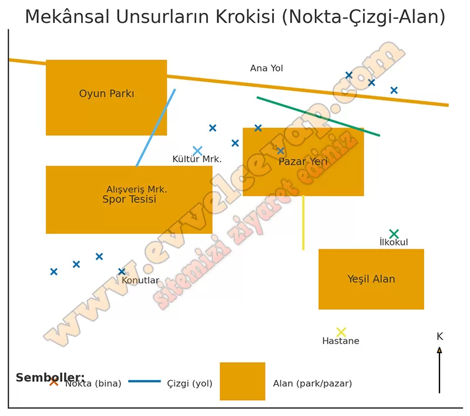
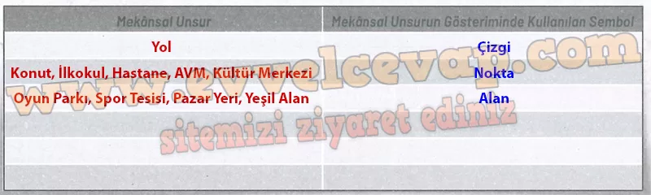

## 10. Sınıf Coğrafya Ders Kitabı Cevapları Meb Yayınları Sayfa 30

**BAŞLARKEN**

**Soru: Aşağıda uydu görüntüsü verilen alanda bulunan mekânsal unsurları (ev, oyun parkı, kültür merkezi, okul, yol vb.) belirleyiniz.**

* **Cevap**: Yol/kavşaklar, konutlar, spor tesisi, oyun parkı, alışveriş merkezi, kültür merkezi, pazar yeri, ilkokul, hastane ve yeşil alanlar vardır.

**Soru: Belirlediğiniz mekânsal unsurların krokisini aşağıdaki çizim alanına nokta, çizgi ve alan sembollerini kullanarak çiziniz.**

* **Cevap**: Krokide yolları **çizgi**, tekil binaları (okul, hastane, AVM, kültür merkezi, konut) **nokta**, geniş alanları (oyun parkı, spor tesisi, pazar yeri, yeşil alan) **alan** sembolüyle göster.

**Soru: Çizdiğiniz krokide yer alan mekânsal unsurları ve bu unsurların gösteriminde kullandığınız sembolü (nokta, çizgi, alan) aşağıdaki tabloya yazınız.**

**10. Sınıf Meb Yayınları Coğrafya Ders Kitabı Sayfa 30**