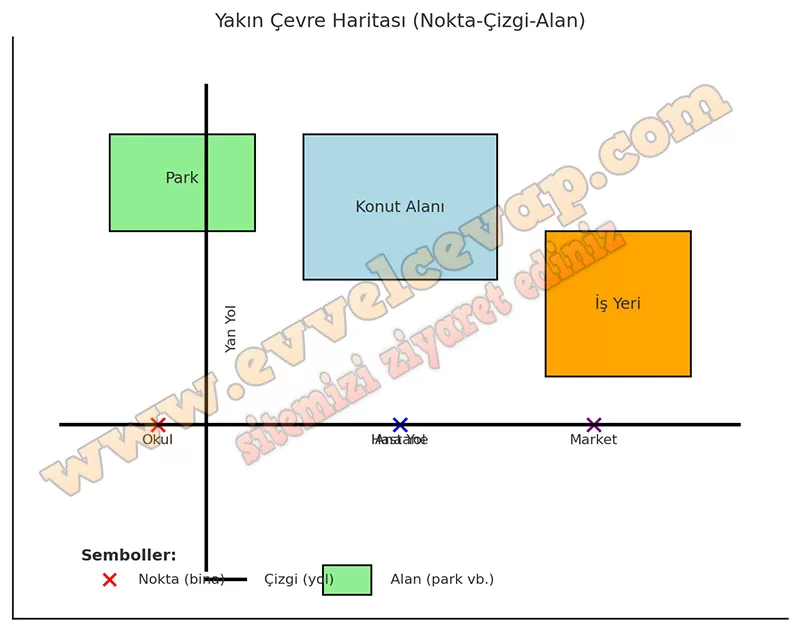

## 10. Sınıf Coğrafya Ders Kitabı Cevapları Meb Yayınları Sayfa 37

Mekansal veri, herhangi bir özelliğin konumunu (nerede olduğunu) ifade ederken mekansal olmayan veri belirli bir konuma sahip özellik hakkında tanıtıcı bilgileri ifade eder. Mekansal verilerin haritalardaki gösteriminde üç sembol kullanılır. Bunlar nokta, çizgi ve alandır. Okul, ev, lokanta vb. şekli ve sınırları küçük olan mekansal veriler için nokta; yol, akarsu vb. mekansal veriler için çizgi; göl, orman gibi mekansal veriler için alan kullanılır.

**Gelecek Derse Hazırlık**

**Soru: 1) Yapılacak çalışma için sınıfta öğretmeninizin rehberliğinde öğrenci sayısına uygun olarak heterojen gruplar oluşturup her gruptan bir öğrenciyi gözlemci olarak seçiniz.**

* **Cevap**: Öğretmenimizin yönlendirmesiyle sınıfta farklı özelliklere sahip öğrencilerden gruplar kurarız ve her gruptan bir gözlemci seçeriz.

**Soru: 2) Grup olarak yakın çevrenize yönelik oluşturacağınız haritanın amacını belirleyiniz.**

* **Cevap**: Yakın çevremizdeki okul, park, yol ve sağlık merkezlerini göstermek amacıyla bir harita oluştururuz.

**Soru: 3) Grup olarak yakın çevrenize yönelik oluşturacağınız haritaya ait mekânsal verileri elde etmek amacıyla dijital harita uygulamalarını inceleyiniz.**

* **Cevap**: Google Maps gibi dijital harita uygulamalarını kullanarak bu mekânsal verileri toplar ve haritamızda kullanırız.

**Etkinlik**

**Amaç**: Mekansal bilgi teknolojileri yardımıyla yakın çevresine yönelik harita oluşturabilme  
 **Yönerge** : Aşağıdaki işlem adımlarını uygulayınız.

**1. Adım**: Grup olarak dijital harita uygulamalarından ve yakın çevrenize ait elde ettiğiniz mekansal verilerden (park alanlarının, konut alanlarının, iş yerlerinin, ulaşım yollarının dağılışı vb.) hareketle ne tür bir harita oluşturmak istediğinizi belirleyiniz.  
 **2. Adım**: Oluşturmak istediğiniz harita türüne göre elde ettiğiniz mekansal verileri, haritada gösterilmesinde kullanacağınız nokta, çizgi ve alan sembollerine göre tasnif ediniz.  
 **3. Adım**: Tasnif ettiğiniz mekansal verilere göre belirlediğiniz sembolleri kullanarak (haritayı oluşturan unsurları da dikkate alarak) haritanızı oluşturunuz.  
 **4. Adım**: Grup gözlemciniz aracılığıyla kendi haritanızı diğer grupların çalışmalarıyla karşılaştırıp güncelleyiniz.

Yakın çevreye ait nokta–çizgi–alan sembollerini kullanarak örnek bir harita oluşturdum.

📍 Okul, hastane ve market **nokta** ile;  
🛣️ Ana yol ve yan yol **çizgi** ile;  
🌳 Park, konut ve iş yeri bölgeleri **alan** ile gösterildi.

Haritayı indir (PNG)

**Değerlendirme**

**Soru: Yapılan çalışmaya yönelik diğer sayfada verilen kontrol listesini doldurunuz.**

* **Cevap**: **Bu etkinliğin cevabı diğer sayfadadır. (Bkz. sayfa 38)**

**10. Sınıf Meb Yayınları Coğrafya Ders Kitabı Sayfa 37**