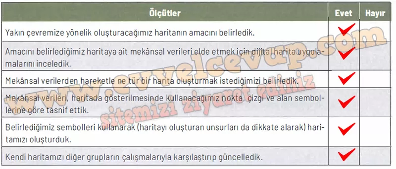

## 10. Sınıf Coğrafya Ders Kitabı Cevapları Meb Yayınları Sayfa 38

**Kontrol Listesi**

**Soru: Mekânsal bilgi teknolojileriyle harita oluşturma etkinliğine ilişkin değerlendirme yapmak amacıyla aşağıdaki maddeleri okuyunuz ve her maddeye ilişkin tablodaki ilgili yerleri işaretleyiniz. “Hayır” bölümündeki işaretleriniz birden fazlaysa öğretmeniniz yardımıyla eksik öğrenmelerinizi tamamlayınız.**

**Gelecek Derse Hazırlık**

**Soru: Sizlerden bir sonraki derste yakın çevrenize ait uydu görüntüsü üzerinde vektör veriler (nokta, çizgi, alan) kullanarak harita oluşturmanız beklenmektedir. Bu nedenle ders öncesi aşağıdaki çalışmaları yapınız.**

**Soru: 1) Yakın çevrenize ait oluşturmak istediğiniz haritanın amacını belirleyiniz.**

* **Cevap**: Yakın çevremdeki okul, sağlık ocağı, park ve yolları göstermek amacıyla bir harita oluşturacağım.

**Soru: 2) Oluşturmak istediğiniz haritanın amacına uygun olan mekânsal verileri toplayınız.**

* **Cevap**: Okul, sağlık ocağı ve market gibi binalar (nokta), ana yol ve ara yollar (çizgi), park ve konut bölgeleri (alan) mekânsal veri olarak toplanacaktır.

**Soru: 3) Oluşturacağınız haritanın yöntemini belirleyerek gerekli araç ve gereçleri temin ediniz.**

* **Cevap**: Haritayı nokta-çizgi-alan yöntemiyle çizeceğim. Cetvel, kalem, silgi ve dijital harita uygulamaları gibi araçları hazırlayacağım.

**Performans Çalışması**

**Harita Oluşturma**

Beceri : Harita, Kendini Tanıma (Öz Farkındalık), Kendini Düzenleme (Öz Düzenleme), Kendini Uyarlama (Öz Yansıtma)

**Soru: Yakın çevrenize ait uydu görüntüsü üzerinde vektörveriler(nokta, çizgi, alan)kullanarak sizden istenilen harita oluşturma çalışması için aşağıdaki işlem adımlarını uygulayınız.**

* **Cevap**: Yakın çevreme ait okul, sağlık ocağı, market, park, konut ve yolları göstermek amacıyla bir harita hazırladım.

**Soru: Belirlediğiniz amaca, elde ettiğiniz mekansal verilere ve haritada kullanacağınız yönteme göre temin ettiğiniz araç gereçlerle haritanızı oluşturunuz.**

* **Cevap**: Haritada okul, sağlık ocağı ve marketi nokta, yolları çizgi, park, konut ve spor alanlarını alan sembolleriyle göstererek haritamı oluşturdum.

**Soru: Oluşturduğunuz haritanın günlük hayatta sağlayacağı kolaylıklar hakkındaki görüşlerinizi arkadaşlarınızla paylaşınız.**

* **Cevap**: Bu harita günlük hayatta ulaşım kolaylığı sağlar, ihtiyaç duyulan yerlere yön bulmayı kolaylaştırır ve çevrenin düzenini daha iyi anlamamıza yardımcı olur.

**Değerlendirme**

Çalışma, analitik dereceli puanlama anahtarı ve öz değerlendirme formuyla değerlendirilecektir. Analitik dereceli puanlama anahtarının ölçütleri; oluşturulan haritanın belirlenen amaca uygunluğu, oluşturulan harita için toplanan mekânsal verilerin yeterliliği, oluşturulan harita için belirlenen yöntem ile seçilen araç gereç kullanımının uygunluğu, oluşturulan haritanın günlük hayatta kullanımıdır.

**10. Sınıf Meb Yayınları Coğrafya Ders Kitabı Sayfa 38**