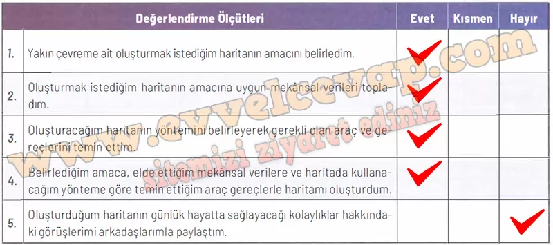

## 10. Sınıf Coğrafya Ders Kitabı Cevapları Meb Yayınları Sayfa 40

**Öz Değerlendirme Formu**

**Soru: Aşağıda verilen ölçütler, kendi çalışmanız hakkında belirlemeler yapmanız için düzenlenmiştir. Çalışmanızla ilgili ifadeler size uygunsa “Evet”i, biraz uygunsa “Kısmen’i, uygun değilse ”Hayır”ı işaretleyiniz. Tüm ifadeleri işaretlemeyi unutmayınız.**

**Soru: Çalışmanız hakkındaki görüşlerinizi yazınız.**

**✅Çalışmam sırasında öğrendiğim bilgiler**: Nokta, çizgi ve alan sembolleriyle harita oluşturmayı ve mekânsal verilerin önemini öğrendim.

**✅Çalışmam sırasında zorlandığım yerler**: Haritada sembolleri doğru yerleştirmekte biraz zorlandım.

**✅Çalışmamı yeniden yapacak olsaydım dikkat edeceğim hususlar**: Daha düzenli ve ayrıntılı bir harita çizmeye dikkat ederdim.

**Soru: Çalışmalarınızı verimli bir şekilde sürdürebilmeniz için ‘Hayır” ve “Kısmen” seçeneklerini işaretlediğiniz konular ile çalışma sırasında zorlandığınız öğrenmeleri tekrar ediniz. İhtiyaç duyduğunuz konularda öğretmeninizden destek alarak eksiklerinizi tamamlayınız.**

* **Cevap**: Eksik kaldığım noktaları tekrar etmeli, özellikle harita sembollerini kullanma konusunda daha çok pratik yapmalı ve öğretmenimden destek alarak eksiklerimi tamamlamalıyım.

**10. Sınıf Meb Yayınları Coğrafya Ders Kitabı Sayfa 40**