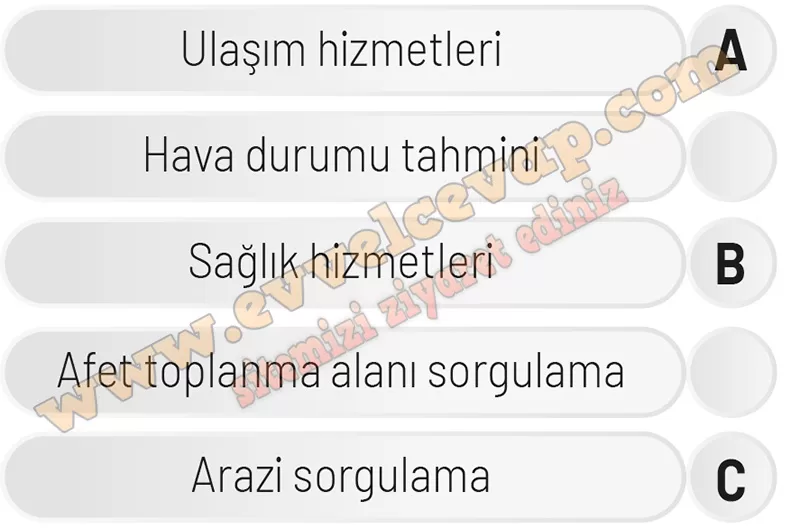

## 10. Sınıf Coğrafya Ders Kitabı Cevapları Meb Yayınları Sayfa 41

**Soru: 1-3. soruları aşağıda verilen metin ve görsellere göre cevaplayınız.**

CBS ve uzaktan algılama yöntemleri; belediye hizmetleri, mühendislik uygulamaları, ormancılık, tarım, arazi kullanımı, rekolte tahmini, hidroloji, çevre kirliliği, jeoloji, jeofizik, ulaşım, navigasyon hizmetleri, planlama, arkeoloji, askerî uygulamalar gibi alanlarda da kullanılmaktadır. Aşağıda insanların günlük hayatında kullandığı CBS ve uzaktan algılama uygulamalarından bazılarının görselleri verilmiştir.

**Soru: 1) Görselleri verilen uygulamaların aşağıdaki alanlardan hangisinde kullanıldığım belirleyip uygulama’ nın harfini ilgili yere yazınız.**

**Soru: 2) Görselleri verilen uygulamalar insanlara günlük hayatta ne tür kolaylıklar sağlar? Açıklayınız.**

* **Cevap**: A uygulaması ulaşımı kolaylaştırırken, B uygulaması nöbetçi eczaneleri bulmayı sağlar. C uygulaması ise tapu ve arazi bilgilerine hızlı erişim sunar.

**Soru: 3) İnsanların günlük hayatını kolaylaştıran başka CBS tabanlı hangi uygulamalar bulunmaktadır? Örnekler veriniz.**

* **Cevap**: Google Maps, Yandex Navigasyon, e-Devlet harita servisleri, Deprem Ağı uygulaması, İBB CepTrafik gibi CBS tabanlı uygulamalar günlük yaşamda yol tarifi, trafik, deprem takibi ve hizmet bilgilerine ulaşmayı kolaylaştırır.

**10. Sınıf Meb Yayınları Coğrafya Ders Kitabı Sayfa 41**