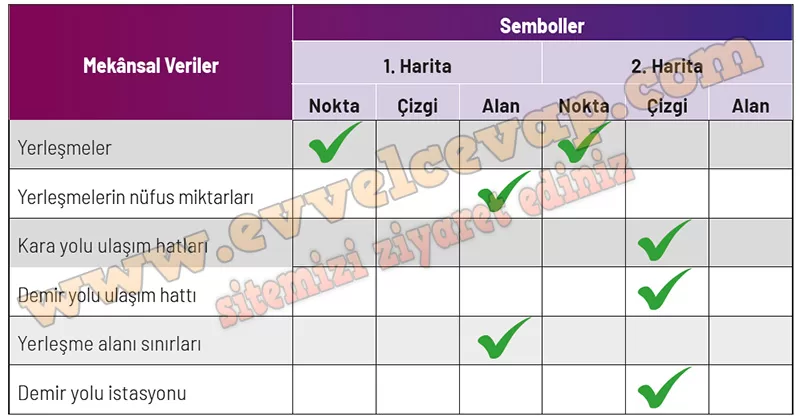

## 10. Sınıf Coğrafya Ders Kitabı Cevapları Meb Yayınları Sayfa 43

**Soru: 4) Aşağıda verilen mekansal verilerin hangi haritada kullanıldığını belirleyip ilgili kutucuğu işaretleyiniz.**

**Soru: 5) Mekansal verilerin haritalarda gösteriminde kullanılan sembollerin (nokta, çizgi, alan} ne olduğunu aşağıdaki tabloya işaretleyiniz.**

**Soru: 6) Bu haritalar günlük hayatta hangi amaçlarla kullanılmaktadır? Açıklayınız.**

* **Cevap**: Haritaların amacı ve konusu farklı olduğu için seçilen veriler değişir; ayrıca ölçek, gösterim yöntemi ve verinin tarihi/güncelliği de fark yaratır. Farklı kaynaklardan toplanan veriler ve ihtiyaca göre yapılan genelleştirme düzeyi de mekânsal verileri çeşitlendirir.

**Soru: 7) Bu haritalar günlük hayatta hangi amaçlarla kullanılmaktadır? Açıklayınız.**

**✅1. Harita**: Okul-sağlık gibi hizmetlerin yer seçimi, yatırım ve afet planlaması, pazar analizi için kullanılır.

**✅2. Harita**: Seyahat ve lojistikte rota planlama, yeni yol/hat tasarımı, trafik ve acil erişim planlaması için kullanılır.

**10. Sınıf Meb Yayınları Coğrafya Ders Kitabı Sayfa 43**