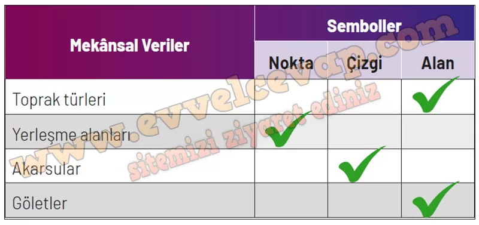

## 10. Sınıf Coğrafya Ders Kitabı Cevapları Meb Yayınları Sayfa 44

**Soru: 8-11. soruları Uşak ili Banaz ilçesine a it mekânsal bilgi teknolojileri kullanılarak çizilmiş aşağıdaki haritayı inceleyerek cevaplayınız.**

**Soru: 8) Bu harita hangi alanlarda kullanılabilir?**

* **Cevap**: Tarım ve arazi kullanım planlaması, sulama–erozyon kontrolü, ağaçlandırma ve havza yönetimi; yerleşim için uygun alanların belirlenmesi gibi çalışmalarda kullanılabilir.

**Soru: 9) Haritanın amaca uygun olarak oluşturulmasında hangi tür mekânsal veriler elde edilmiştir?**

* **Cevap**: Toprak türlerinin dağılışı (allüvyal, kolüvyal, orman toprakları vb.), su unsurları (su yüzeyi, sürekli/mevsimlik akarsular), yerleşmeler (ilçe merkezi, köyler) ve havza sınırına ait mekânsal veriler elde edilmiştir.

**Soru: 10) Elde edilen mekansal verilerin haritadaki gösteriminde kullanılan sembollerin (nokta, çizgi, alan) ne olduğunu aşağıdaki tabloya işaretleyiniz.**

**Soru: 11) İnsanlar, oluşturulan bu haritayı günlük hayatta hangi amaçlar doğrultusunda kullanabilir?**

* **Cevap**: İnsanlar bu haritayı tarıma uygun alanları seçmek, sulama ve toprak verimliliğini değerlendirmek, yerleşim yeri planlamak ve doğal kaynakları korumak için kullanabilir.

**10. Sınıf Meb Yayınları Coğrafya Ders Kitabı Sayfa 44**