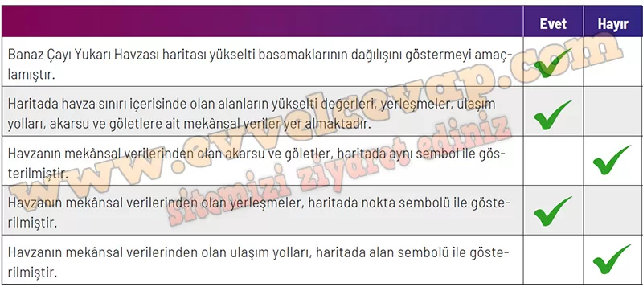

## 10. Sınıf Coğrafya Ders Kitabı Cevapları Meb Yayınları Sayfa 45

**Soru: 12. soruyu mekânsal bilgi teknolojisi kullanılarak oluşturulmuş aşağıdaki haritaya göre cevaplayınız.**

**Soru: 12) Banaz Çayı Yukarı Havzası’nın topografya haritası oluşturulurken**

**Soru: Haritanın amacı nedir?**

* **Cevap**: Havzanın yer şekillerini (yükselti-eğim, vadi/sırt) ve drenaj ağını gösterip planlama/arazi kullanımı için altlık sunmak.

**Soru: Haritada kullanılacak mekânsal veriler nelerdir?**

* **Cevap**: Eş yükselti eğrileri (100 m ve 20 m), su yüzeyleri, sürekli ve mevsimlik akarsular, havza sınırı; yerleşmeler (ilçe merkezi, köy, şehir merkezi) ve ulaşım hatları (karayolu, demiryolu).

**Soru: Elde edilen mekânsal verilerin haritadaki gösteriminde kullanılacak semboller neler olmalıdır? sorularına cevap aranmış ve elde edilen cevaplara uygun olarak aşağıdaki harita oluşturulmuştur.**

* **Cevap**: Kahverengi izohips çizgileri (ana/tali), mavi çizgi ve alanlar (akarsu/su yüzeyi), siyah/kırmızı çizgiler (karayolu/demiryolu), nokta semboller (yerleşmeler) ve kalın sınır çizgisi (havza sınırı).

**Soru: Banaz Çayı Yukarı Havzası’nın topoğrafya haritasına göre aşağıdaki kontrol listesini, haritanın çizimi öncesinde sorulan sorulara uygunluk açısından doldurunuz.**

**10. Sınıf Meb Yayınları Coğrafya Ders Kitabı Sayfa 45**