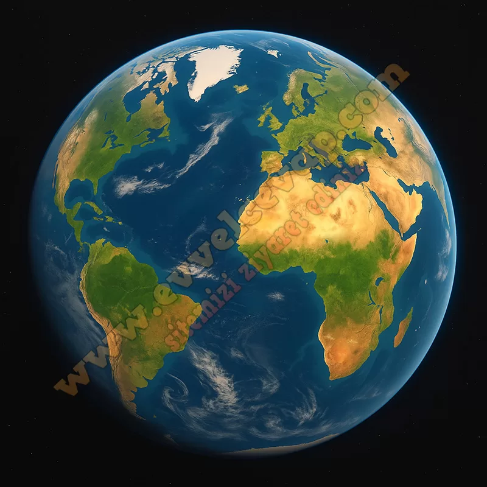

## 10. Sınıf Coğrafya Ders Kitabı Cevapları Meb Yayınları Sayfa 56

**Soru: Levha tektoniğine bağlı olarak kıta ve okyanusların konumunda ve görünümünde geçmişten bugüne yaşanan değişimi gösteren haritaları inceleyiniz. 10 milyon yıl sonra Dünya’nın görünümünde nasıl bir değişim yaşanabileceğini levhaların yılda yaklaşık 10 cm hareket ettiğini dikkate alarak aşağıda verilen boş alana çiziniz.**

* **Cevap**: 10 milyon yılda büyük kıta değişimi olmaz; Atlas biraz genişler, Pasifik daralır. Afrika kuzeye itildiğinden Akdeniz küçülür, Avustralya kuzeye ilerleyip Endonezya’ya yaklaşır, Doğu Afrika Yarığı genişler (Kızıldeniz büyür), Kaliforniya batıya-kuzeybatıya kayar.

**Değerlendirme**

**Soru: Süreç sonunda aşağıdaki soruları cevaplayıp cevaplarınızı arkadaşlarınızla paylaşınız.**

**Soru: 1) Levha tektoniği yaşanmamış olsaydı yer kabuğunda yaşanan süreçlerden hangilerinin gerçekleşmesi beklenemezdi?**

* **Cevap**: Levha tektoniği olmasaydı dağ oluşumu, depremler, volkanlar, okyanus ortası sırtları ve yeni kara parçaları oluşmazdı.

**Soru: 2) Karalardaki bu değişim gelecekte iklimi, canlı türlerini ve insan yaşamını nasıl etkileyebilir? Açıklayınız.**

* **Cevap**: Karaların yer değiştirmesi iklim kuşaklarını değiştirir, bazı canlı türleri yok olurken yenileri ortaya çıkar. İnsan yaşamında göçler, tarım alanlarının değişmesi ve yeni yerleşim alanları ortaya çıkabilir.

**10. Sınıf Meb Yayınları Coğrafya Ders Kitabı Sayfa 56**