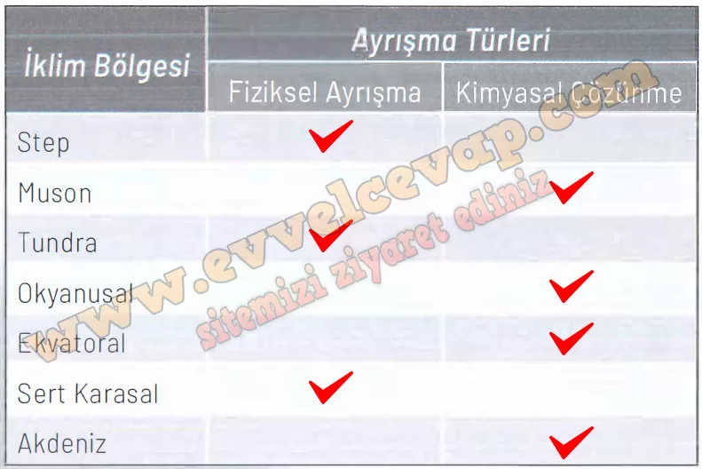

## 10. Sınıf Coğrafya Ders Kitabı Cevapları Meb Yayınları Sayfa 74

**Etkinlik**

**Ayrışma Süreçleri**

Amaç Ayrışma süreçleri ile iklim ve kayaç özellikleri arasındaki ilişkiyi yapılandırabilme  
 Yönerge Aşağıdaki işlem adımlarını uygulayınız.

**Soru: Sınıfta öğrenci sayısına göre öğretmen rehberliğinde heterojen gruplar oluşturunuz.**

**Soru: Aşağıda verilen soruların cevaplarını grup üyesi arkadaşlarınızla tartışınız.**

**Soru: 1) Yeryüzünde bulunan farklı türdeki kayaçların (magmatik, tortul, başkalaşım) ayrışma hızlarındaki farklılıkların nedenleri nelerdir?**

* **Cevap**: Minerallerin yapısı (çözünürlük), kristal boyutu/sertlik, gözeneklilik–çatlaklılık ve kayaç türü (magmatik/metamorfik dirençli; kireçtaşı, jips gibi tortullar daha hızlı) ayrışma hızını değiştirir.

**Soru: 2) İklim özellikleri kayaçların ayrışma hızında ne tür bir etkiye sahiptir?**

* **Cevap**: Sıcaklık ve nem arttıkça kimyasal çözünme hızlanır; kurak-soğuk ortamlarda fiziksel ayrışma (donma-çözülme, ısıl genleşme, tuz çatlatması) öne çıkar.

**Soru: Aşağıda verilen iklim bölgelerinde, aynı özelliğe sahip kayaçlarda hangi ayrışma türünün daha ön planda olduğunu tablodaki ilgili alana işaretleyiniz.**

**Soru: Aşağıdaki dünya haritasında gösterilen numaralanmış alanlar ile bu alanların iklim özelliklerini yansıtan grafikleri inceleyiniz. Bu alanlarda bulunan kayaçlarda daha etkin olan ayrışma türü ile ayrışmanın hızı hakkındaki çıkarımlarınızı grup arkadaşlarınızla paylaşınız.**

✅(Kaliforniya–Akdeniz iklimi): **Kimyasal ayrışma baskın**, hız **orta** (kış yağışı var, yaz kurak).

✅(Güney Avrupa/Anadolu içleri–yarı kurak/karasal): **Fiziksel ayrışma baskın**, hız **orta** (don–çözülme etkili).

✅(Orta Asya–soğuk/kurak): **Fiziksel ayrışma** (donma) **baskın**, hız **yavaş**.

✅(Güneydoğu Asya–muson/ekvatoral): **Kimyasal ayrışma** **çok baskın**, hız **hızlı** (sıcak ve çok nemli).

**10. Sınıf Meb Yayınları Coğrafya Ders Kitabı Sayfa 74**