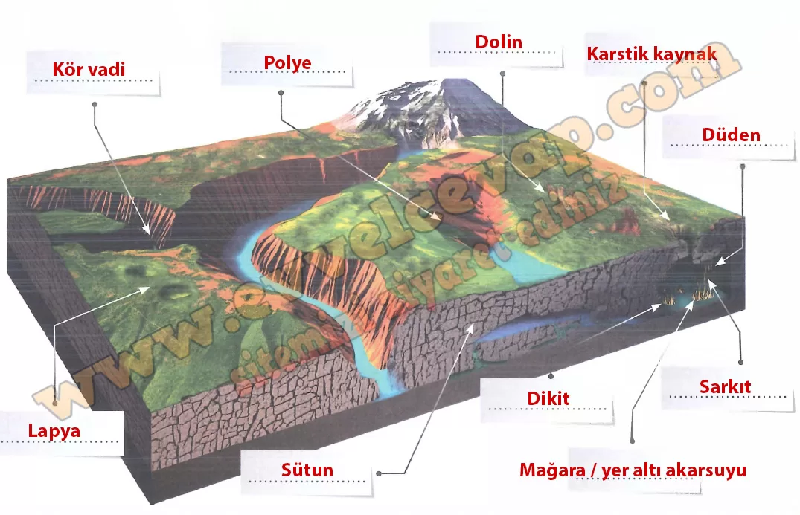

## 10. Sınıf Coğrafya Ders Kitabı Cevapları Meb Yayınları Sayfa 84

Yer altına sızan suların ve yer altı su tablasının kayaçları çözmesiyle mağara ve obruk oluşur (Görsel 3.25).

Karstlaşmış arazilerde çözünmüş minerallerin yeryüzünde ya da yer altında tekrar çökelmesiyle biriktirme şekilleri oluşmaktadır. Mağaralarda tavandan aşağı damlayan sudaki çözünmüş minerallerin çökelmesiyle sarkıt, suyun zemine düştüğü yerde minerallerin çökelmesiyle dikit, sarkıtlar ve dikitlerin birleşmesiyle de sütun adı verilen oluşumlar meydana gelmektedir. İçinde çözünmüş kalsiyum karbonat bulunan yer altı sularının yeryüzüne çıktığı yerde meydana gelen çökelmelerle de travertenler oluşmaktadır.

**Uygulama**

**Soru: Çözünebilen kayaçlarda aşınım ve birikim süreçlerinin etkisine bağlı oluşan yeryüzü şekillerinin isimlerini görseldeki boş bırakılan alanlara yazınız.**

**10. Sınıf Meb Yayınları Coğrafya Ders Kitabı Sayfa 84**