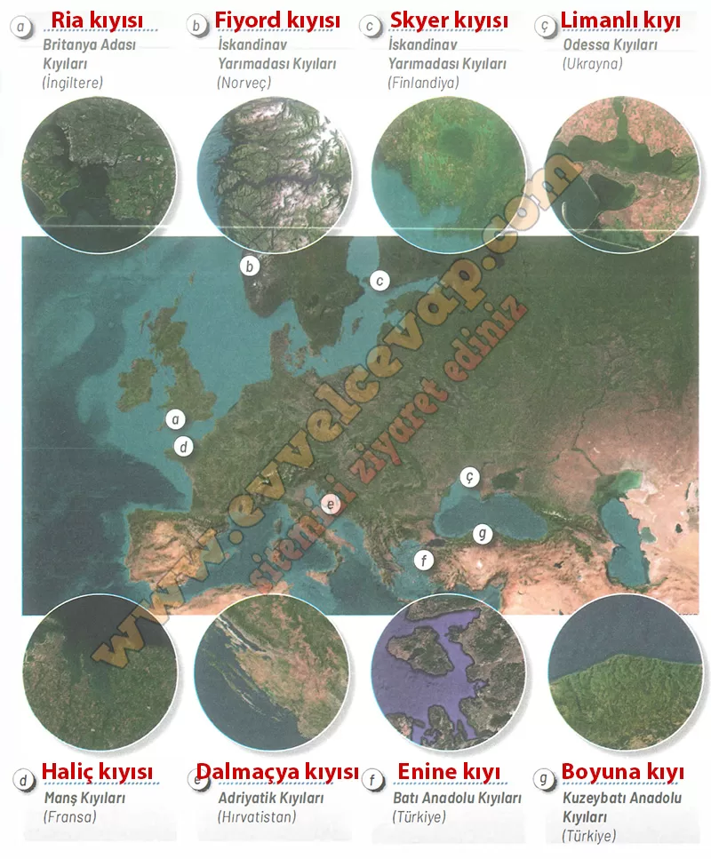

## 10. Sınıf Coğrafya Ders Kitabı Cevapları Meb Yayınları Sayfa 87

**Uygulama**

**Soru: Görselde yerleri harflerle gösterilen kıyılarda hangi kıyı tipi olduğunu boş bırakılan alanlara yazıp aşağıdaki soruyu cevaplayınız. (a-b-c-ç-d-e-f-g)**

**Soru: Yazmış olduğunuz kıyı tiplerinin oluşum özellikleri dikkate alındığında hangilerinin Türkiye’de oluşma ihtimali yoktur? Açıklayınız.**

* **Cevap**: b, c, d → Türkiye’de fiyord ve skyer için gerekli buzul şekillenmesi yok; haliç için de gelgit genliği çok küçük.

**10. Sınıf Meb Yayınları Coğrafya Ders Kitabı Sayfa 87**