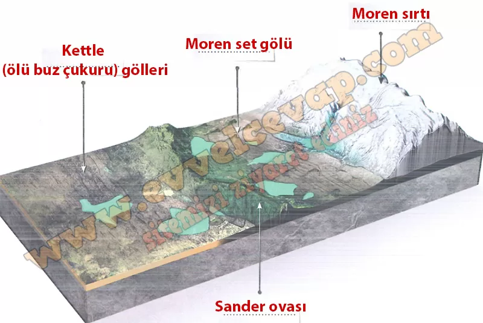

## 10. Sınıf Coğrafya Ders Kitabı Cevapları Meb Yayınları Sayfa 90

Buzul biriktirmesi ile oluşan en yaygın oluşumlar buzulun sürüklediği kum ve çakıl boyutundaki malzemenin birikmesiyle meydana gelen morenlerdir. Buzulun bittiği yerde buzula paralel şekilde yığılmış morenler ise cephe moreni (moren seti) olarak adlandırılır. Buzullardan eriyen suyun etkisiyle cephe moreninin kenarlarından aşağı doğru sürüklenen

**Uygulama**

**Soru: Buzul alanlarında biriktirme süreçlerinin etkisine bağlı oluşan yeryüzü şekillerinin isimlerini görseldeki boş bırakılan alanlara yazıp aşağıdaki soruyu cevaplayınız. (1-2-3-4)**

**Soru: Buzul topografyasının bulunduğu bölgelerde insan yerleşmesinin çok az olmasının sebepleri neler olabilir? Açıklayınız.**

* **Cevap**: Yüksek ve çok soğuk iklim, engebeli relief ve ince–verimsiz topraklar ile ulaşım–altyapı zorlukları ve çığ/buzul taşkını riski yerleşmeyi sınırlar.

**10. Sınıf Meb Yayınları Coğrafya Ders Kitabı Sayfa 90**