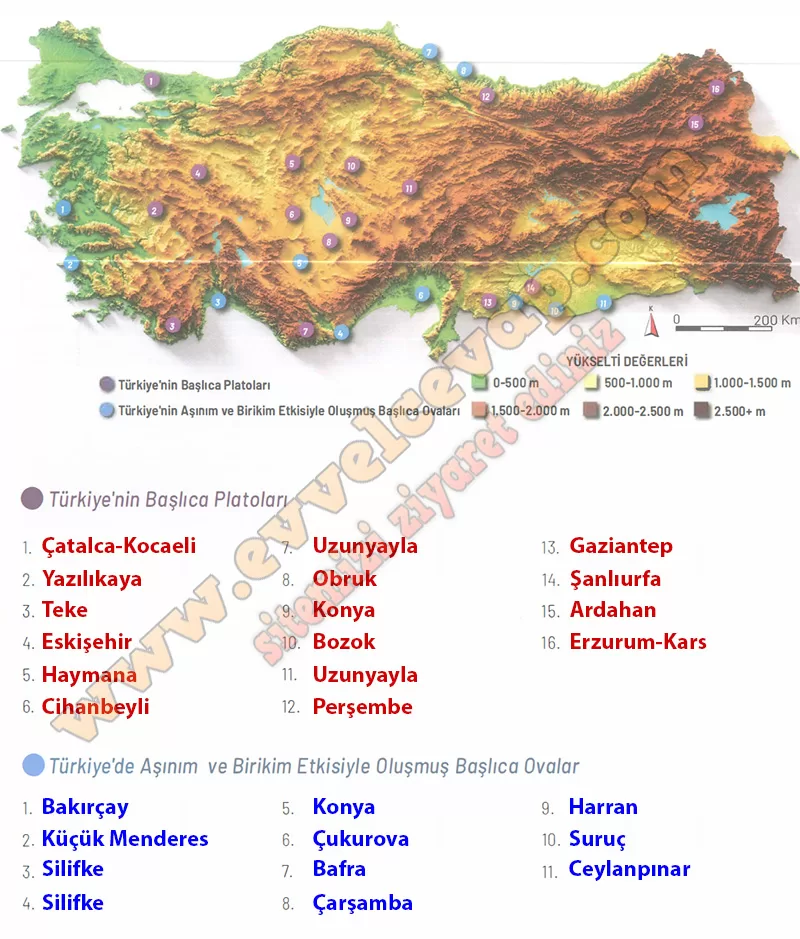

## 10. Sınıf Coğrafya Ders Kitabı Cevapları Meb Yayınları Sayfa 93

**Uygulama**

**Soru: Haritada konumları numaralandırılarak gösterilmiş, aşınım ve birikim etkisiyle oluşmuş yeryüzü şekillerinin isimlerini atlaslarınızdan yararlanarak boş bırakılan alana yazıp soruyu cevaplayınız.**

**Soru: Ova ve platolar insan yaşamı için neden önemlidir? Örneklerle açıklayınız.**

* **Cevap**: Ovalar düz ve verimli oldukları için tarım, ulaşım ve yerleşme için uygundur (ör. Çukurova, Bafra). Platolar yazın hayvancılık ve tahıl tarımı için elverişlidir, sulama ve enerji projeleriyle yerleşimi destekler (ör. Erzurum‑Kars, Haymana).

**10. Sınıf Meb Yayınları Coğrafya Ders Kitabı Sayfa 93**