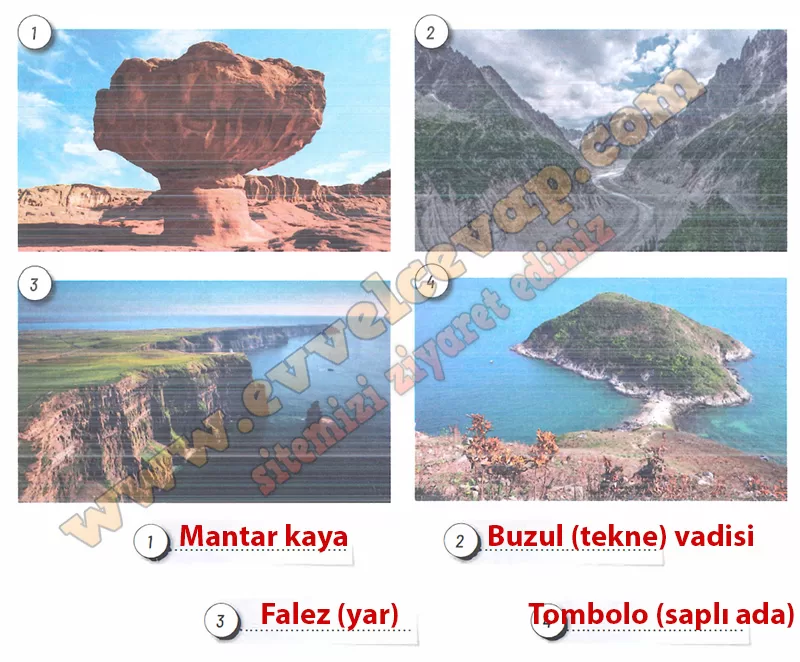

## 10. Sınıf Coğrafya Ders Kitabı Cevapları Meb Yayınları Sayfa 94

**Etkinlik**

**Aşınım ve Birikim Süreçleri ile Yeryüzü Şekilleri**

**Amaç**: Yeryüzü şekillerinin oluşumunda etkili olan aşınım ve birikim süreçlerini çözümleyebilme  
 **Yönerge**: Aşağıdaki işlem adımlarını uygulayınız.

**Soru: Aşağıdaki soruları numaralanmış görsellerde verilen yeryüzü şekillerini inceleyerek cevaplayınız.**

**Soru: 1) Numaralanmış görsellerdeki yeryüzü şekillerinin neler olduğunu aşağıya yazınız.**

**Soru: 2) Yazdığınız yeryüzü şekillerinin oluşumunda hangi dış etkenler rol oynamıştır?**

* **Cevap**: Rüzgâr aşındırması; 2- Buzul aşındırması; 3- Dalga aşındırması; 4- Dalga ve kıyı akıntısının biriktirmesi (kıyı oku).

**Soru: 3) Bu yeryüzü şekillerinin oluşumunda aşınım ve birikim süreçlerinden hangileri etkili olmuştur?**

* **Cevap**: 1‑2‑3 aşınım, 4 birikim süreciyle oluşmuştur.

**10. Sınıf Meb Yayınları Coğrafya Ders Kitabı Sayfa 94**