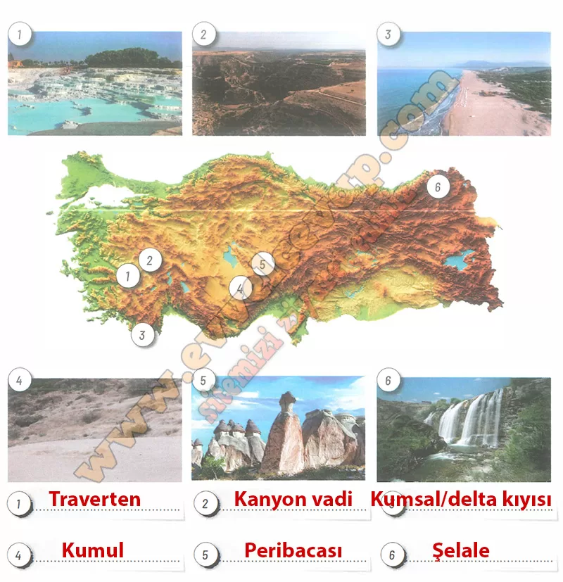

## 10. Sınıf Coğrafya Ders Kitabı Cevapları Meb Yayınları Sayfa 95

**Soru: Aşağıdaki soruları Türkiye’de aşınım ve birikim süreçlerinin etkisiyle oluşan, haritada konumları gösterilmiş bazı yeryüzü şekillerine ait numaralanmış görselleri inceleyerek cevaplayınız.**

**Soru: 1) Numaralanmış görsellerdeki yeryüzü şekillerinin neler olduğunu aşağıya yazınız.**

* **Cevap**: Traverten 2) Kanyon vadi 3) Kumsal/delta kıyısı 4) Kumul (rüzgâr birikimi) 5) Peribacası 6) Şelale.

**Soru: 2) Görsellerde verilen yeryüzü şekillerinin oluşumunda hangi kuvvetlerin aşınım ve birikim süreçleri etkili olmuştur?**

✅Karstik suların kalsiyum karbonat çökeltmesi (birikim).

✅Akarsuyun derine aşındırması.

✅Dalga ve kıyı akıntılarının alüvyon biriktirmesi.

✅Rüzgârın kumları taşıyıp biriktirmesi.

✅Tüf üzerinde yağmur‑akarsu, rüzgâr ve don‑çözülme aşındırması.

✅Eğim kırığı/direnç farkı nedeniyle düşey aşındırma, tabanda dev kazanı.

**Soru: 3) Görsellerdeki yeryüzü şekillerinin oluşumunda etkili olan kuvvetlerin aşınım ve birikim süreçleriyle yeryüzü şekillerinin bulunduğu alanların coğrafi koşulları arasında nasıl bir ilişki vardır? Açıklayınız.**

* **Cevap**: Bu şekiller bulunduğu yerin jeolojisi ve iklimiyle uyumludur. Karstik alanlarda traverten, dağlık‑eğimli ve faylı yerlerde kanyon/şelale, kurak‑rüzgârlı düzlüklerde kumul, sığ kıyılarda kıyı birikimi, volkanik tüf ve yarı kurak iklimde peribacaları oluşur.

**Soru: Diğer sayfada verilen çalışma yaprağını süreç sonunda doldurunuz.**

**10. Sınıf Meb Yayınları Coğrafya Ders Kitabı Sayfa 95**