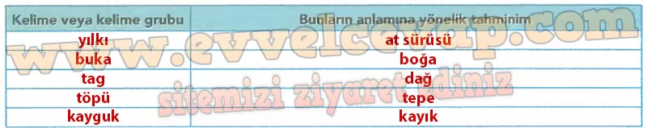
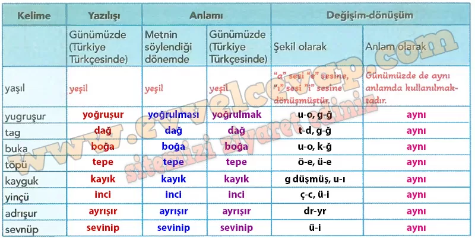
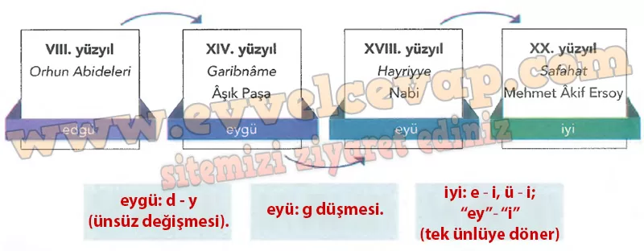

## 10. Sınıf Türk Dili ve Edebiyatı Ders Kitabı Cevapları Meb Yayınları Sayfa 19

**Soru: 1) Aşağıdaki tabloya okuduğunuz koşuğun orijinal metninde anlamım bilmediğiniz kelime veya kelime gruplarım, bunların anlamlarına dair tahminlerinizi yazınız.**

**Soru: 2) Okuduğunuz koşukta geçen kelimelerin zaman içinde şekil ve anlam yönünden nasıl bir değişim ve dönüşüm geçirdiğini ortaya koymak için aşağıdaki tabloyu inceleyerek boş bırakılan yerleri örnekteki gibi tamamlayınız.**

**Soru: 3) Aşağıdaki infografikte “iyi” sözcüğünün Türkçenin yazılı metinlerle takip edilebilen dönemlerindeki değişimi gösterilmiştir. İnfografikten hareketle “iyi” sözcüğünün günümüze kadar geçirdiği ses değişimlerini ilgili kutucuklara yazınız.**

**10. Sınıf Meb Yayınları Türk Dili ve Edebiyatı Ders Kitabı Sayfa 19**