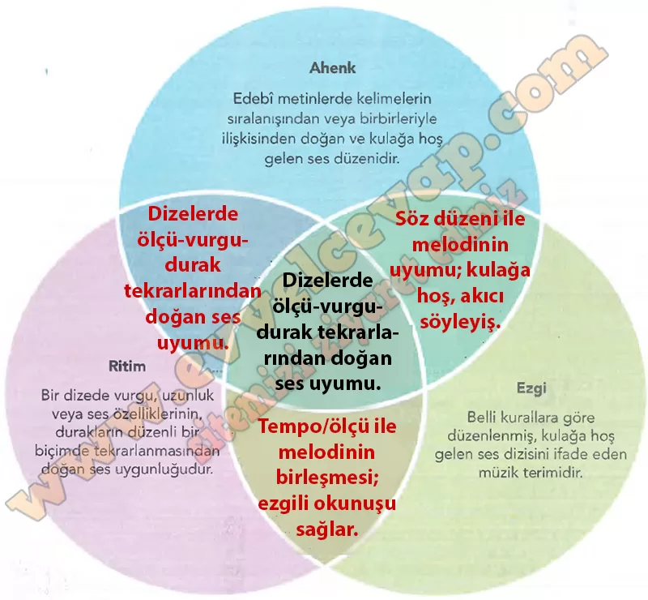

## 10. Sınıf Türk Dili ve Edebiyatı Ders Kitabı Cevapları Meb Yayınları Sayfa 22

**Soru: 1) Aşağıdaki Venn şemasında yer alan ahenk, ezgi ve ritim kavramlarının tanımlarını okuyunuz. Bu tanımlardaki ortak ve farklı yönleri tespit ederek bunları şema üzerinde ilgili yerlere yazınız.**

**Soru: 2) Okuduğunuz koşukta birbiriyle ahenkli kelimeler hangileridir? Bu kelimeler hangi yönleriyle şiirin ahengine katla sağlamıştır? Yazınız.**

* **Cevap**: “Bulut–yağmur–su”, “dağ–taş–aşar”, “boğa–böğrüşür” gibi kelimeler ahenkli. Ses benzerliği, kafiye ve tekrarlarla şiirin akışını güçlendirmiştir.

**Soru: 3) Okuduğunuz koşuğun teması nedir? Aynı temada bir şiir yazacak olsanız şiirinizin ezgili bir şekilde okunması için hangi ahenk unsurlarını kullanırdınız? Yazınız.**

* **Cevap**: Koşuğun teması doğanın canlanması ve bahardır. Aynı temada hece ölçüsü, yarım kafiye, redif ve aliterasyon kullanırdım.

**Soru: 4) Okuduğunuz koşukta ahengi sağlayan kelimelerin temayı yansıtmada etkili olduğunu düşünüyor musunuz? Açıklayınız.**

* **Cevap**: Evet, ahenkli kelimeler doğanın hareketini ve coşkusunu yansıtarak temayı daha etkili kılmıştır.

**10. Sınıf Meb Yayınları Türk Dili ve Edebiyatı Ders Kitabı Sayfa 22**