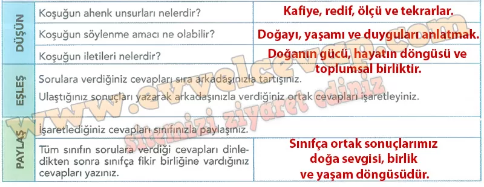

## 10. Sınıf Türk Dili ve Edebiyatı Ders Kitabı Cevapları Meb Yayınları Sayfa 23

**Soru: Yönergeleri takip ederek aşağıdaki çalışmayı yapınız.**

**Soru: Aşağıdaki soruları yazılı olarak cevaplayınız.**

**Sıra Sizde**

**Soru: Okuduğunuz koşuktan ve aşağıdaki metinden faydalanarak soruları cevaplayınız.**

**REŞİDE HATİCE HANIM VAKFI**

**HAYVANLARA SU İÇİREN VAKIF**

Vakfın gelirinden bin kuruş ile İstanbul’da ihtiyaç bulunan bir mahalde bir su kuyusu kazılacak, buraya bir mermer taban, bilezik ve tulumba ve tulumbanın yanına gelip geçen Müslümanların abdest almaları için üç musluklu bir mermer taş tekne konulacak, taş teknenin yanına hayvanların su içmesi için yine bir taş tekne yapılarak hayvanların su içmesi sağlanacaktır.

**OSMANLILARIN HAYVAN SEVGİSİ**

Devrin hayvanseverlerinden Reşide Hatice Hanım sokak hayvanlarının özellikle yaz günleri susuz kalmaması için kısıtlı imkanlara sahip vakfiye bütçesinden pay ayrılmasını şart koşmuştu. İstanbul’da bir su kuyusu açılmasını vakfiye şartnamesine koyan Reşide Hatice Hanım bu kuyudan çıkan suyun Müslümanların abdest alması için kullanılmasını, ayrıca hemen yanına bir yalak yapılarak sokak hayvanlarının da bu sudan istifade etmesini istemişti.

**Soru: 1) Reşide Hatice Hanım’ın karakteriyle ilgili çıkarımlarınızı arkadaşlarınızla paylaşınız.**

* **Cevap**: Reşide Hatice Hanım merhametli, yardımsever ve hayvansever bir insandır.

**Soru: 2)**

**Soru: a) Toplumda hangi sorunlara çözüm üretmek veya hangi alanlarda farkındalık yaratmak amacıyla bir vakıf kurmayı düşünürdünüz?**

* **Cevap**: Ben eğitimde fırsat eşitliği sağlamak için bir vakıf kurmak isterdim.

**Soru: b) Kuracağınız vakıf bünyesinde ne tür projeler üretmek isterdiniz?**

* **Cevap**: Maddi durumu olmayan öğrencilere burs vermek, kütüphane kurmak ve ücretsiz kurslar açmak projelerim olurdu.

**10. Sınıf Meb Yayınları Türk Dili ve Edebiyatı Ders Kitabı Sayfa 23**