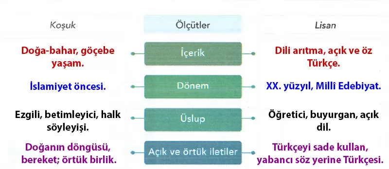

## 10. Sınıf Türk Dili ve Edebiyatı Ders Kitabı Cevapları Meb Yayınları Sayfa 24

**Soru: 1) Sayfa 17-18’de okuduğunuz koşukla aşağıdaki şiiri, tabloda verilen ölçülere göre karşılaştırarak bu şiirlerin benzer ve farklı yönlerini tespit ediniz. Bu tespitleri yaparken nasıl bir yol izlediğinizi gerekçeleriyle açıklayınız.**

**LİSAN**

Açık sözle kalmalı  
 Fikre ışık salmalı;  
 Müteradif sözlerden  
 Türkçesini almalı.

Yeni sözler gerekse  
 Bunda da uy herkese;  
 Halkın söz yaratmada  
 Yollarını benimse.

**✅İçerik:** Koşuk: doğa-bahar, göçebe yaşam. | Lisan: dili arıtma, açık ve öz Türkçe.

**✅Dönem:** Koşuk: İslamiyet öncesi. | Lisan: XX. yüzyıl, Millî Edebiyat.

**✅Üslup:** Koşuk: ezgili, betimleyici, halk söyleyişi. | Lisan: öğretici, buyurgan, açık dil. **Benzerlik:** İkisi de dörtlük, hece, uyak-redif kullanır.

**✅Açık/örtük iletiler:** Koşuk: doğanın döngüsü, bereket; örtük birlik. | Lisan: Türkçeyi sade kullan, yabancı söz yerine Türkçesi; örtük millî dil bilinci.

**Soru: 2) Şimdiye kadar edindiğiniz bilgilerden ve yukarıdaki tabloda yaptığınız tespitlerden harekede sözlü gelenekle ilgili genellemeleri yazınız. Yazdığınız genellemeleri arkadaşlarınızla paylaşınız.**

* **Cevap**: Sözlü gelenek ezgi ve ritme dayanır; dörtlük, hece, kafiye ve tekrarlarla kuşaktan kuşağa aktarılır. Konular çoğunlukla doğa, toplumsal yaşam ve yiğitliktir.

**Soru: 3) Koşuğun ve Lisan adlı şiirin içeriğini nasıl bir görselle yansıtmak isterdiniz? Gerekçelendirerek açıklayınız.**

* **Cevap**: Koşuk için yayla-bahar, bulut-yağmur ve kopuz çalan ozanın olduğu bir görsel seçerdim. Lisan için sade bir sayfa, kalem ve “Türkçe” sözcüklerinin ışık saçtığı bir afiş; çünkü şiir dilin arınmasını ve fikre ışık vermeyi savunur.

**10. Sınıf Meb Yayınları Türk Dili ve Edebiyatı Ders Kitabı Sayfa 24**