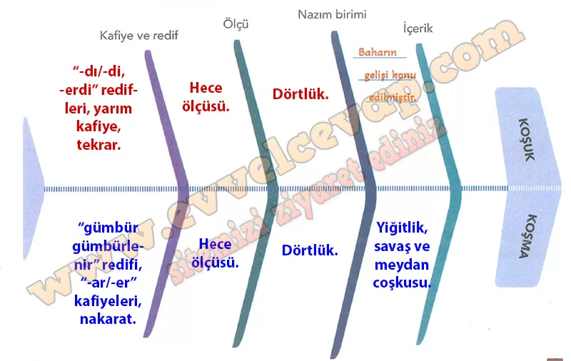

## 10. Sınıf Türk Dili ve Edebiyatı Ders Kitabı Cevapları Meb Yayınları Sayfa 27

**Soru: Okuduğunuz koşuğu, aşağıda verilen koşma ile içerik ve yapı özellikleri açısından karşılaştırarak balık kılçığı diyagramında gösteriniz.**

Mert dayanır, nâmert kaçar  
 Meydan gümbür gümbürlenir  
 Şahlar şahı divan açar  
 Divan gümbür gümbürlenir

Yiğit kendini övende  
 Oklar menzili dövende  
 Kılıç kalkana deyende  
 Kalkan gümbür gümbürlenir

Ok atılır kalasından  
 Hak saklasın belâsından  
 KÖROGLU’nun narasından  
 Dağlar gümbür gümbürlenir

**Cevap (balık kılçığına yazılacaklar)**:

**Kafiye ve redif**  
Koşuk: “-dı/-di, -erdi” redifleri, yarım kafiye, tekrar.  
Koşma: “gümbür gümbürlenir” redifi, “-ar/-er” kafiyeleri, nakarat.

**Ölçü**  
Koşuk: Hece ölçüsü.  
Koşma: Hece ölçüsü.

**Nazım birimi**  
Koşuk: Dörtlük.  
Koşma: Dörtlük.

**İçerik**  
Koşuk: Doğa/baharın gelişi, bereket.  
Koşma: Yiğitlik, savaş ve meydan coşkusu.

**10. Sınıf Meb Yayınları Türk Dili ve Edebiyatı Ders Kitabı Sayfa 27**