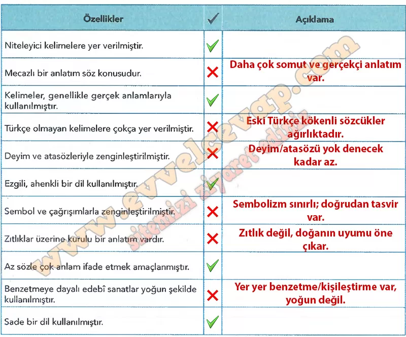

## 10. Sınıf Türk Dili ve Edebiyatı Ders Kitabı Cevapları Meb Yayınları Sayfa 28

**Soru: 1) a) Aşağıdaki tabloda, tahlil ettiğiniz koşuğun dil ve anlatım özellikleriyle ilgili cümleler verilmiştir. Doğru olduğunu düşündüğünüz özelliği onaylama işareti (✓) ile işaretleyiniz. Yanlış olduğunu düşündüğünüz özelliğin doğrusunu yazınız.**

**Soru: b) Koşuğun ezgi ve ahenginin şiirde tespit ettiğiniz dil ve anlatım özelliklerine olan etkisi ve katkısıyla ilgili düşüncelerinizi yazınız.**

* **Cevap**: Ezgi ve ahenk, dili akıcı ve akılda kalıcı yapar; tekrar, kafiye ve ölçü anlamı pekiştirir, duyguyu yükseltir. Sözlü söyleyişi kolaylaştırır.

**Soru: 2) a) Koşuğun dil ve anlatım özelliklerinden hareketle söyleyicinin üslup seçimi hakkındaki görüşlerinizi yazınız.**

* **Cevap**: Söyleyici yalın, somut ve betimleyici bir üslup seçmiştir. Kısa dizeler, tekrarlar ve hece ölçüsüyle coşkulu bir akış kurmuştur.

**Soru: b) Söyleyicinin böyle bir üslup seçmesinin sebepleri neler olabilir? Düşüncelerinizi arkadaşlarınızla paylaşınız.**

* **Cevap**: Sözlü gelenekte kolay ezberlenip birlikte söylenmesi için böyle bir üslup gerekir. Halkı etkilemek, tören ve şölenlerde kopuzla uyum sağlamak içindir.

**10. Sınıf Meb Yayınları Türk Dili ve Edebiyatı Ders Kitabı Sayfa 28**