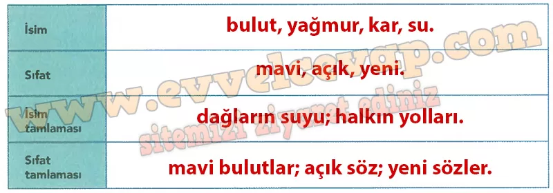

## 10. Sınıf Türk Dili ve Edebiyatı Ders Kitabı Cevapları Meb Yayınları Sayfa 29

**Soru: 1) Tahlil ettiğiniz koşuktan ve Lisan adlı şiirden alman aşağıdaki parçalardan tabloda istenen kelime ve kelime grubu çeşitlerini bularak ilgili alana yazınız.**

**GÜNÜMÜZ TÜRKÇESİYLE**

Döktü bulut yağmurunu,  
 Gerip tutuyor ak torunu,  
 Kırlara bıraktı karını,  
 Seller akar, şarıldaşır.

Karlar buzlar hep eridi,  
 Dağların suyu yürüdü,  
 Mavi bulutlar belirdi,  
 Kayıklar gibi kımıldaşır.

Kuydı bulut yagmurın,  
 Kerip tutar ak torın,  
 Kırka kodtı ol karın,  
 Akın akar enreşür.

Kar büz kamug erüşdi,  
 Taglar suvı akışdı,  
 Kökşin bulıt örüşdi,  
 Kayguk bolup ügrişür.

**LİSAN**

Açık sözle kalmalı  
 Fikre ışık salmalı;  
 Müteradif sözlerden  
 Türkçesini almalı.

Yeni sözler gerekse  
 Bunda da uy herkese;  
 Halkın söz yaratmada  
 Yollarını benimse.

**Soru: 2) İsim ve sıfatların, bunlarla kurulan tamlamaların metnin içeriğine, dil ve anlatımına katkısıyla ilgili görüşlerinizi arkadaşlarınızla paylaşınız.**

* **Cevap**: İsimler doğa unsurlarını somutlaştırır, sıfatlar betimlemeyi ve duyguyu güçlendirir. İsim ve sıfat tamlamaları ayrıntıyı netleştirir, dili akıcı ve ahenkli kılar.

**10. Sınıf Meb Yayınları Türk Dili ve Edebiyatı Ders Kitabı Sayfa 29**