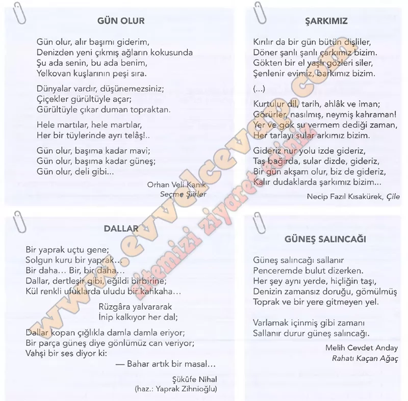

## 10. Sınıf Türk Dili ve Edebiyatı Ders Kitabı Cevapları Meb Yayınları Sayfa 36

**Soru: Aşağıdaki şiirlerden faydalanarak sorulan cevaplayınız.**

**Soru: 1) Farklı dönemlerde söylenen/yazılan şiirlerin aynı temayı işlemesiyle ilgili düşünceleriniz nelerdir?**

* **Cevap**: Farklı dönemlerde aynı tema, insanın değişmeyen duygularını gösterir. Yalnız dil ve üslup döneme göre değişir.

**Soru: 2) Tahlil ettiğiniz koşukla yukarıdaki şiirleri içerik ve tema açısından ilişkilendirerek bu şiirlerden hangisinin koşukla benzer özellikler taşıdığını tespit ediniz. Bu tespitleri yaparken nasıl bir yol izlediğinizi açıklayınız.**

* **Cevap**: Koşuğa en çok “Gün Olur” benzer; ikisi de doğayı ve özgürlük duygusunu canlı imgelerle verir. Bunu tema ve ana kelimeleri karşılaştırarak belirledim.

**Soru: 3) a) Belirlediğiniz şiirde söyleyicinin hitap ettiği varlık ya da kavrama yönelik duyguları hakkında neler söyleyebilirsiniz?**

* **Cevap**: Söyleyici doğaya hayran ve özgürlük isteğiyle coşkulu; kaçıp uzaklaşmak ister.

**Soru: b) Şairin okuyucuya aktarmak istediği duygu ve düşünceler nelerdir?**

* **Cevap**: Okura, doğanın insanı özgürleştirip ferahlattığını ve rutinden kaçışın mümkün olduğunu sezdirir.

**Soru: c) Belirlediğiniz şiirde açık ve örtük iletili dizeler hangileridir? Açık ve örtük iletili dizelere birer örnek veriniz.**

* **Cevap**: Açık iletİ: “Gün olur, alır başımı giderim.” Örtük ileti: “Dünyalar vardır, düşünemezsiniz” (sınırları aşma, yeni olasılıklar).

**Soru: 4) Belirlediğiniz şiirin temasıyla şairin ruhsal durumu arasında nasıl bir ilişki kurulabilir? Şiirden örnekler vererek açıklayınız.**

* **Cevap**: Şairin ruh hâli özgür, dalgalı ve coşkulu; “Gün olur, başıma kadar mavi/güneş; Gün olur, deli gibi…” dizeleri bunu yansıtır.

**Soru: 5) Yukarıdaki şiirlerden faydalanarak şiir-şair ilişkisi hakkında çıkarımlarda bulununuz.**

* **Cevap**: Şiir, şairin iç dünyasını ve döneminin bakışını taşır; seçilen imgeler ve ahenk şairin kişiliğiyle doğrudan ilişkilidir.

**10. Sınıf Meb Yayınları Türk Dili ve Edebiyatı Ders Kitabı Sayfa 36**