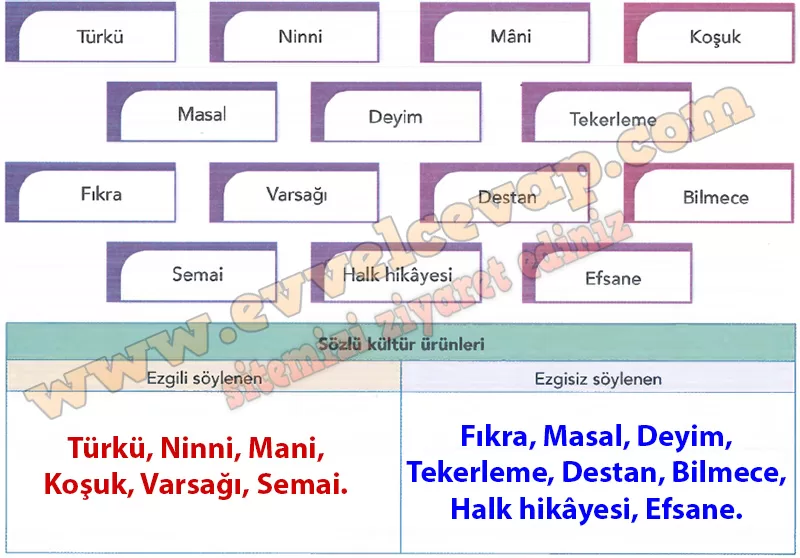

## 10. Sınıf Türk Dili ve Edebiyatı Ders Kitabı Cevapları Meb Yayınları Sayfa 40

**Soru: 1) Toplumların, geleneklerini şiirsel bir dille yansıtmalarının gerekçeleri neler olabilir?**

* **Cevap**: Gelenekleri şiirle yansıtmak, hem duyguları güçlü ifade etmek hem de kolay hatırlanıp kuşaktan kuşağa aktarılmasını sağlamak içindir.

**Soru: 2) a) Okuduğunuz şiirde türküye ait hangi unsurlara yer verilmiştir?**

* **Cevap**: Türkülerin saflığı, doğallığı, halkın acı ve sevinçleri, imzasız ama yürekten gelen sözleri anlatılmıştır.

**Soru: b) Siz olsaydınız türkülerin hangi yönlerini şiirinize yansıtırdınız?**

* **Cevap**: Ben olsaydım türkülerin umut, dayanışma ve toplumsal birlik yönlerini yansıtırdım.

**Soru: 3) Şair, şiirini oluştururken toplumun hangi özelliklerini ön plana çıkarmıştır? Bu özellikler hangi manevi değerlerle ilişkilendirilebilir? Gerekçelendirerek açıklayınız.**

* **Cevap**: Şair, halkın içtenliği, doğayla bağı ve samimiyetini öne çıkarmıştır. Bunlar sevgi, kardeşlik, sadelik ve dürüstlük gibi manevi değerlerle ilişkilidir.

**Soru: 4) Okuduğunuz şiire göre türkü, söyleyiciyle toplum arasında nasıl bir bağ kurmuştur?**

* **Cevap**: Türkü, bireyin duygularıyla toplumun ortak belleğini birleştirerek arada güçlü bir duygu bağı kurmuştur.

**Sıra Sizde**

**Soru: 1) Aşağıdaki sözlü kültür ürünlerinin söyleyiş özellikleriyle ilgili tahminlerinizi tabloda ilgili başlıkların altına yazınız.**

**Soru: 2) Türkü tutturmak, türkü çağırmak, türkü yakmak, köy türküsü” ifadelerinin anlamlarını tahmin ediniz. Tahminlerinizin doğruluğunu TDK Güncel Türkçe Sözlük’ten kontrol ediniz.**

**✅Türkü tutturmak:** Türkü söylemeye başlamak.

**✅Türkü çağırmak:** Türkü söylemek.

**✅Türkü yakmak:** Yeni bir türkü söylemek ya da bestelemek.

**✅Köy türküsü:** Halk arasında doğup yayılan ezgili şiir.

**Soru: 3)** “Birlikte türkü söyleyebildiklerim benim milliye timdendir.” Nevzat Kösoğlu  
 “Bir milletin türkülerini yakanlar kanunlarını yapanlardan daha güçlüdür.” Shakespeare (Şekspir) **Yukarıdaki alıntılarda türkülerin hangi yönüne vurgu yapılmaktadır? Açıklayınız.**

* **Cevap**: Bu alıntılarda türkülerin milletin duygularını, birliğini ve kimliğini koruma gücü vurgulanıyor.

**Soru: 4) Dizi ve filmlerde sıklıkla türkülerden yararlanılmaktadır. Yapımcılar, dizi ve filmlerde türkülerin hangi toplumsal etkisinden yararlanmayı amaçlıyor olabilir? Görüşlerinizi arkadaşlarınızla paylaşınız.**

* **Cevap**: Yapımcılar, türkülerin insanlarda ortak duygu uyandırma, geçmişi hatırlatma ve sahnelerin etkisini artırma gücünden yararlanmak istiyor olabilir.

**10. Sınıf Meb Yayınları Türk Dili ve Edebiyatı Ders Kitabı Sayfa 40**