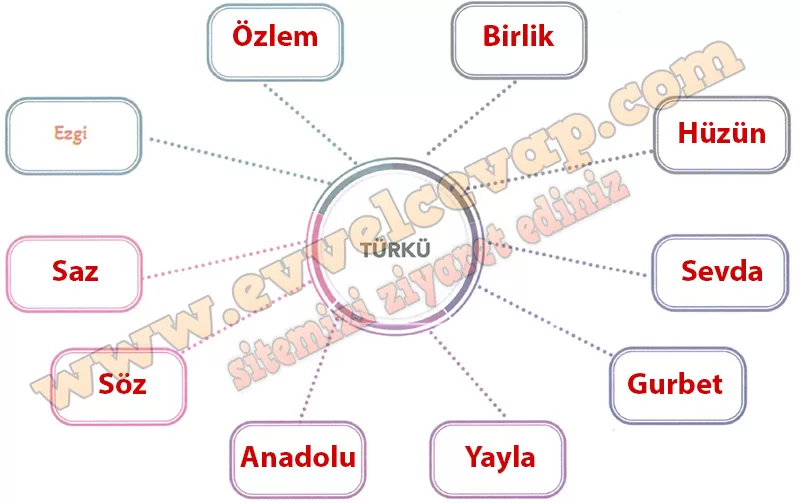

## 10. Sınıf Türk Dili ve Edebiyatı Ders Kitabı Cevapları Meb Yayınları Sayfa 41

**Soru: 5) a) Türkü kelimesinin size çağrıştırdıklarını aşağıdaki kutucuklara yazınız.**

**Soru: b) Kutucuklara yazdığınız ifadelerden faydalanarak aklınıza gelen türkü isimlerini yazınız.**

* **Cevap**: Uzun İnce Bir Yoldayım, Çanakkale Türküsü, Yemen Türküsü, Ordu’nun Dereleri, Mihriban, Sarı Gelin, Hekimoğlu, Mağusa Limanı, Kara Tren.

**Sıra Sizde**

**Soru: Metni okumaya başlamadan önce yandaki karekodu etkileşimli cihazınıza okutarak içeriği dinleyiniz.**

**Soru: Müziğin sizde uyandırdığı duygudan hareketle okuyacağınız türkünün içeriğiyle ilgili tahminlerde bulununuz.**

* **Cevap**: Türkünün hüzün, hasret ve sevgiliye özlem duygularını anlatacağını tahmin ediyorum.

**Soru: Tahminlerinizi yaparken metnin başlığını ve görselini göz önünde bulundurmayı unutmayınız.**

* **Cevap**:  Başlıkta geçen “Turnalar” ve görsel, haberci kuşlar olarak sevgi, yolculuk ve ayrılık temasını düşündürüyor.

**Soru: Türküyü yüksek sesle okuyunuz.**

* **Cevap**: Yüksek sesle okudum.

**Soru: Türküyü ezgili bir şekilde okumaya özen gösteriniz.**

* **Cevap**: Ezgili ve duygulu bir şekilde okudum.

**Soru: Türküyü okurken tahminlerinizin doğruluğunu değerlendiriniz.**

* **Cevap**: Tahminlerim doğru çıktı; turnalar aracılığıyla sevgiliye haber gönderme, hasret ve kavuşma umudu işlendi.

**10. Sınıf Meb Yayınları Türk Dili ve Edebiyatı Ders Kitabı Sayfa 41**