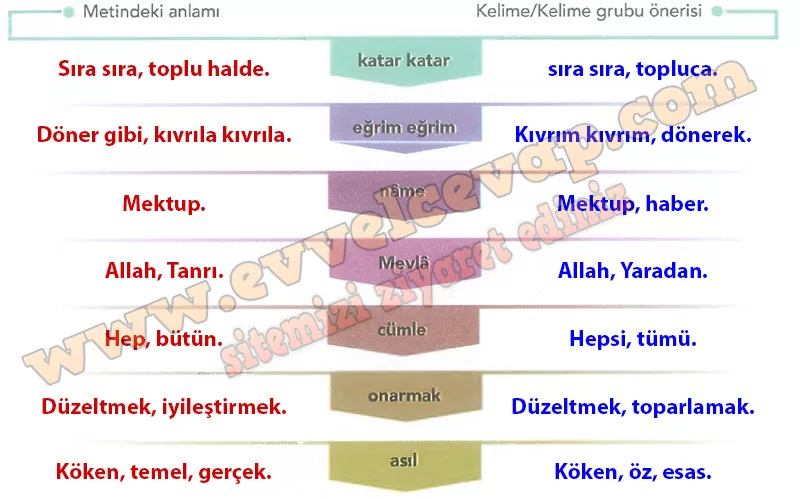
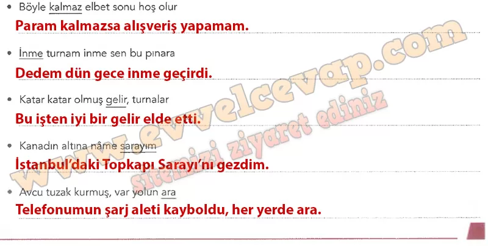

## 10. Sınıf Türk Dili ve Edebiyatı Ders Kitabı Cevapları Meb Yayınları Sayfa 43

**Söz Varlığımız**

**Soru: 1) Okuduğunuz metnin bağlamım göz önünde bulundurarak aşağıdaki kelimelerin/kelime gruplarının anlamlarına yönelik tahminlerde bulununuz. Tahminlerinizin doğruluğunu TDK Güncel Türkçe Sözlük’ten kontrol ederek verilen kelimelerin metindeki anlamlarını yazınız. Türküde geçen bu kelimelerin/kelime gruplarının yerine metnin bağlamım bozmayacak şekilde başka hangi kelimelerin/kelime gruplarının kullanılabileceğine yönelik önerilerinizi yazınız.**

**Soru: 2) Aşağıdaki dizelerde altı çizili kelimeleri farklı anlamlara gelecek şekilde cümle içinde kullanınız.**

**10. Sınıf Meb Yayınları Türk Dili ve Edebiyatı Ders Kitabı Sayfa 43**