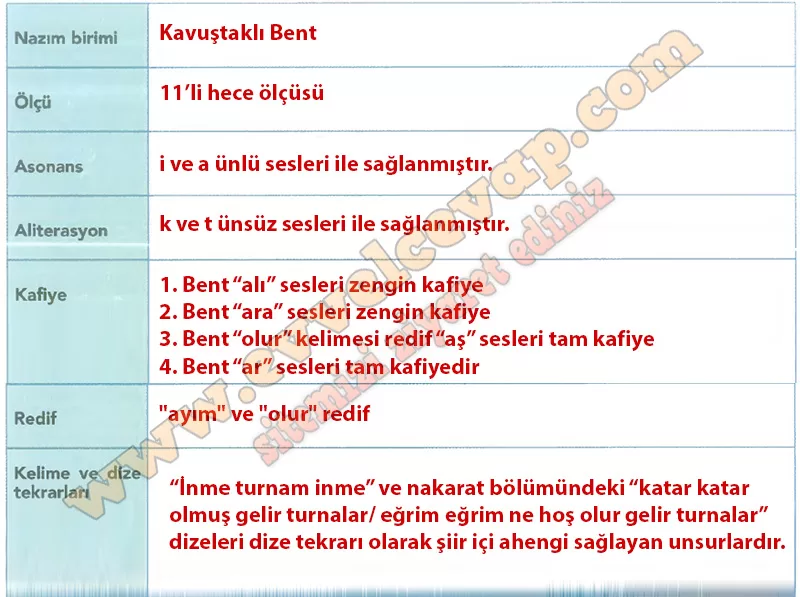

## 10. Sınıf Türk Dili ve Edebiyatı Ders Kitabı Cevapları Meb Yayınları Sayfa 45

**Sıra Sizde**

**Soru: Turnalar türküsünün tabloda verilen ahenk özelliklerini belirleyerek ilgili kavramların karşısına yazınız.**

**Dilimizin İncelikleri**

**Soru: Turnalar türküsünün konusundan yola çıkarak türkünün içeriğine uygun kısa bir hikâye yazınız. Hikâyenin başkahramanım ve turnaları betimleyiniz. Betimleme yaparken hangi sözcük türünü sıklıkla kullandığınızı gerekçesiyle açıklayınız.**

**HİKÂYE**

Hasan, gurbet elde sevdiğinden ayrı kalmış genç bir delikanlıydı. Her gün köyün üstünden geçen turnaları seyrederek sevdiğini hatırlardı. Bir gün gökyüzünde katar katar uçan, kanatları bembeyaz ama uçuşu hüzünlü turnaları gördü. İçlerinden biri yaralıydı, bir diğeri kanadı kırık gibiydi. Hasan, onları görünce kendi yüreğini yaralı hissetti. Turnalara seslenip sevdiğine haber götürmelerini istedi.

**Betimleme:** Turnaları anlatırken *sıfatları* sık kullandım (bembeyaz, yaralı, kırık, hüzünlü). Çünkü sıfatlar varlıkların niteliklerini belirterek okuyucunun gözünde canlı bir tablo oluşturur.

**10. Sınıf Meb Yayınları Türk Dili ve Edebiyatı Ders Kitabı Sayfa 45**