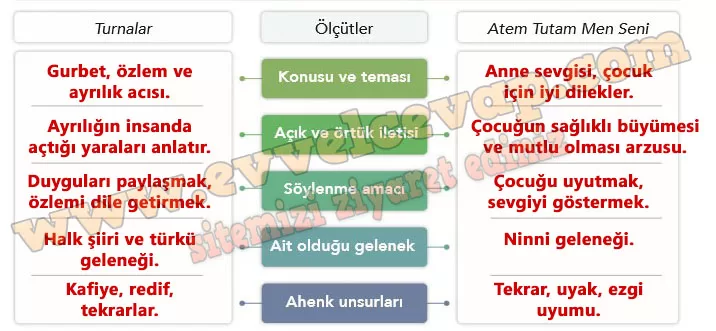

## 10. Sınıf Türk Dili ve Edebiyatı Ders Kitabı Cevapları Meb Yayınları Sayfa 46

**Karşılaştıralım**

**Soru: 1) Turnalar türküsüyle Atem Tutam Men Seni adlı ninniyi tabloda verilen ölçütlere göre karşılaştırınız. Bu şiirlerin benzer ve farklı yönlerini tespit ediniz. Bu tespitleri yaparken nasıl bir yol izlediğinizi gerekçeleriyle açıklayınız.**

* **Cevap**: Şiirleri tabloda verilen ölçütlere göre inceledim. Konu ve amaçlarını metinlerden çıkardım, ait oldukları geleneği türlerinden belirledim. Ahenk unsurlarını da tekrar ve uyaklardan tespit ettim.

**TURNALAR TÜRKÜSÜ**

İki turnam gelmiş aklı kareli  
 İkisine sordum biri nereli  
 O da bencileyin bahtı kareli

Allı turnam gel halime bak benim  
 Bir ok değdi yüreğime pek benim

Turnam ne yatarsın Çukurova’da  
 Yavruların seni arar yuvada  
 Kendim gurbet elde gönlüm sılada

Allı turnam gel halime bak benim  
 Bir ok değdi yüreğime pek benim

**ATEM TUTAM MEN SENİ**

Atem tutam men seni  
 Şekere gatem men seni  
 Akşem baben gelende (oy)  
 Öğüne atem men seni

Hop hopun olsun oğlum  
 Gül topun olsun oğlum  
 Sıralı gavak dibinde (oy)  
 Toyluğun olsun oğlum (oy)

Atem tutam men seni  
 Şekere gatem men seni  
 Akşem baben gelende (oy)  
 Öğüne atem men seni

Ev süpürür toz eder  
 Hamama gider naz eder  
 El ayağı kir içinde  
 Yıkamam diye naz eder

Atem tutam men seni  
 Şekere gatem men seni  
 Akşem baben gelende (oy)  
 Öğüne atem men seni

**Soru: 2) Türkü ve ninni metinlerinin yapı unsurlarına yönelik çıkarımlarınızdan hareketle bu unsurların içeriğe katkısıyla ilgili düşüncelerinizi söyleyiniz.**

* **Cevap**: Türküdeki tekrarlar duyguyu güçlendiriyor, ninnideki nakaratlar ise sakinlik veriyor. Bu yapılar, içeriğin etkisini artırıyor.

**Soru: 3) Turnalar türküsünün ve Atem Tutam Men Seni adlı ninninin içeriğini nasıl bir görselle yansıtmak isterdiniz? Gerekçelendirerek açıklayınız.**

* **Cevap**: Turnalar için gurbeti anlatan uzak yol ve turna kuşları resmi seçerdim. Ninni için ise anne kucağında uyuyan bebek resmi uygun olurdu, çünkü metinlerin duygusunu en iyi bu görseller yansıtır.

**10. Sınıf Meb Yayınları Türk Dili ve Edebiyatı Ders Kitabı Sayfa 46**