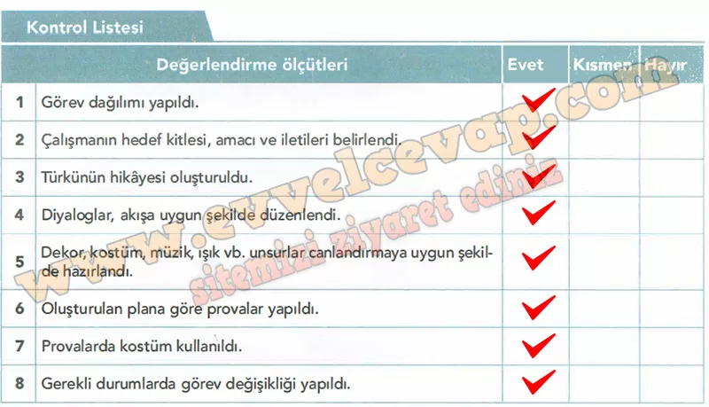

## 10. Sınıf Türk Dili ve Edebiyatı Ders Kitabı Cevapları Meb Yayınları Sayfa 53

**Soru: Hedef kitlenizi ve vermek istediğiniz iletileri göz önünde bulundurarak okuduğunuz türkünün hikâyesini oluşturunuz.**

**HİKÂYE**

Yıl 1915… Çanakkale Savaşı’nın en çetin günleri. Anadolu’nun farklı köylerinden genç delikanlılar, askerlik için yola çıkar. İçlerinden biri de Hasan’dır. Hasan, nişanlısı Elif’i köyde bırakır. Ailesine ve sevdiğine veda ederek Çanakkale’ye gitmek için köy meydanından geçer. Meydan, o günkü adıyla Aynalı Çarşı’dır. Burada askerler toplanır, türküler söylenir, anneler dualar eder.

Hasan, annesinin elini öper:  
— “Ana, hakkını helal et. Ben düşmana karşı gidiyorum.”

Nişanlısı Elif gözyaşlarını tutamaz:  
— “Hasan, sen dönmezsen ben nasıl yaşarım?”

Hasan gözleri dolarak cevap verir:  
— “Merak etme Elif, vatan için gidiyorum. Dönersem düğünümüz olacak, dönemezsem adım bu topraklarda kalacak.”

Askerler hep bir ağızdan türkü söyler:  
“Çanakkale içinde aynalı çarşı,  
Ana ben gidiyom düşmana karşı…”

Savaş başlar, Hasan ve arkadaşları cephede kahramanca savaşır. Kimi şehit düşer, kimi yaralanır. Elif her gün köy meydanında haber bekler. Günler sonra Hasan’dan bir mektup gelir; mektupta şunlar yazar:  
— “Sevgili Elif, biz buradayız, dimdik ayaktayız. Çanakkale geçilmez! Eğer dönemem, bil ki seni hep kalbimde taşıdım.”

Mektup okunurken Elif’in gözlerinden yaşlar süzülür. Köylüler hep birlikte aynı türküyü söylemeye devam eder:  
“Ah gençliğim eyvah!”

**Soru: Oluşturduğunuz hikâyeden canlandırma yapmak üzere diyaloglar belirleyiniz.**

**ÇANAKKALE TÜRKÜSÜ – TİYATRO SENARYOSU**

**KARAKTERLER**

* **Hasan** (genç asker adayı, nişanlı)
* **Elif** (Hasan’ın nişanlısı)
* **Anne** (Hasan’ın annesi)
* **Komutan**
* **Askerler** (toplu halde)
* **Köylüler** (Elif’in yanında)

---

**SAHNE 1 – KÖY MEYDANI, AYNALI ÇARŞI**

*(Meydanda toplanmış köylüler, askerler hazırlanıyor. Arka planda hafif türkü ezgisi duyulur.)*

**Anne:** Hasan oğlum, yolun açık olsun. Hakkım sana helal olsun.  
**Hasan:** Ana, sen de bana hakkını helal et. Dönmezsem üzülme, vatan için gidiyorum.  
**Elif (gözyaşlarıyla):** Hasan… Sensiz nasıl yaşarım?  
**Hasan (Elif’in ellerini tutar):** Elif, üzülme. Dönünce düğünümüz olacak. Dönemezsem, bil ki adım bu topraklarda kalacak.  
**Askerler hep bir ağızdan türküye girer:**  
*“Çanakkale içinde aynalı çarşı,  
Ana ben gidiyom düşmana karşı,  
Ah gençliğim eyvah…”*

---

**SAHNE 2 – CEPHE**

*(Silah sesleri ve davul ritimleri duyulur. Askerler mevzide.)*

**Komutan:** Askerler! Düşman yaklaşıyor, hazır olun!  
**Hasan:** Arkadaşlar, bu topraklar için canımız feda!  
**Askerler (birlikte bağırır):** Çanakkale geçilmez!  
*(Hep birlikte saldırıya geçerler. Fon müziği: türkünün ikinci kıtası.)*

---

**SAHNE 3 – KÖYDE ELİF VE KADINLAR**

*(Köy meydanında kadınlar dua ediyor.)*

**Elif (ağlayarak):** Allah’ım, Hasan’ı koru…  
**Kadın 1:** Sabret kızım, onlar vatanı savunuyor.  
**Kadın 2:** Onların cesareti sayesinde biz özgürüz.

---

**SAHNE 4 – MEKTUP SAHNESİ**

*(Elif köyde, elinde Hasan’ın mektubu. Sessizlik içinde okur.)*

**Elif (yüksek sesle):**  
“Sevgili Elif, biz dimdik ayaktayız. Çanakkale geçilmez! Eğer dönemem, bil ki seni hep kalbimde taşıdım.”  
**Elif (ağlayarak):** Ah Hasan… Seni hiç unutmayacağım.

---

**FİNAL SAHNESİ**

*(Bütün oyuncular sahneye çıkar. Işıklar loşlaşır. Hep birlikte türkü söylenir.)*

**Hep Birlikte:**  
*“Çanakkale içinde bir uzun selvi,  
Kimimiz nişanlı, kimimiz evli…  
Ah gençliğim eyvah…”*

*(Perde kapanır.)*

**Soru: Bu diyalogları anlatının akışına uygun şekilde düzenleyiniz.**

* **Cevap**: Diyalogları akışa göre düzenledik.

**Soru: Hikâyedeki karakterleri canlandıracak kişilerin özelliklerini göz önünde bulundurarak rol dağılımı yapınız.**

* **Cevap**: Karakterlere uygun rol dağılımı yaptık.

**Soru: Canlandırmada kullanacağınız dekor, kostüm, müzik, ışık vb. unsurları belirleyerek bunları nerede ve nasıl kullanacağınıza karar veriniz.**

* **Cevap**: Dekor (cephe görünümü), kostüm (asker üniforması), müzik (türkü ezgisi), ışık (savaş atmosferi) gibi unsurları belirledik.

**Soru: Canlandırmanın hazırlık ve sahnelenme aşamalarında ihtiyaç duyulabilecek başka malzemeleri öngörerek bunlarla ilgili hazırlığınızı yapınız.**

* **Cevap**: İhtiyaç olabilecek malzemeleri (bayrak, mektup, sahte silah vb.) hazırladık.

**Soru: Rolleri nasıl canlandıracağınız konusunda çalışmalar yapınız.**

* **Cevap**: Rollerimizi prova ederek nasıl oynayacağımızı çalıştık.

**Soru: İhtiyaç hâlinde görev dağılımında değişiklikler yapabilirsiniz.**

* **Cevap**: Gerekirse görev değişikliği yapabileceğimizi konuştuk.

**Soru: Canlandırmanızı gerçekleştirmeden önce hazırlıkların tamamlandığından emin olmak için aşağıdaki Kontrol Listesini doldurunuz.**

**Soru: Kontrol Listesinden elde ettiğiniz sonuçlardan faydalanarak eksiğiniz varsa tamamlayınız.**

* **Cevap**: Eksiklerimizi kontrol listesiyle tamamladık.

**Soru: Hazırladığınız çalışmayı imkânlarınız dâhilinde belirlediğiniz bir yerde canlandırınız.**

* **Cevap**: Canlandırmayı okul salonunda sahneledik.

**Soru: Öğretmenlerinizden ve arkadaşlarınızdan gelen geri bildirimlere göre çalışmanızda değişiklikler yaparak hikâyenizi güvenilir platformlarda paylaşabilirsiniz.**

* **Cevap**: Öğretmen ve arkadaşlarımızdan gelen önerilerle çalışmamızı geliştirdik, paylaşmaya hazır hale getirdik.

**Soru: Çalışmanızı hazırlarken öğrendiğiniz veya önemli bulduğunuz bilgileri arkadaşlarınızla paylaşınız.**

* **Cevap**: Çalışmada Çanakkale’nin vatan sevgisi, fedakârlık ve kahramanlık yönünü daha iyi anladığımızı arkadaşlarımızla paylaştık.

**10. Sınıf Meb Yayınları Türk Dili ve Edebiyatı Ders Kitabı Sayfa 53**