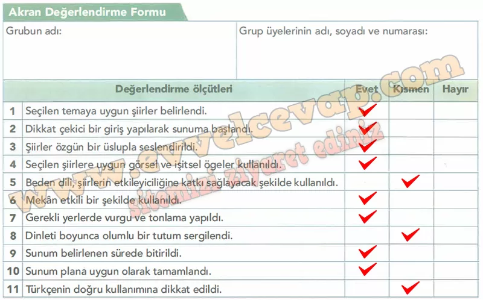
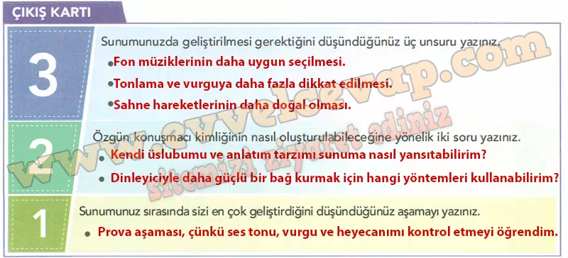

## 10. Sınıf Türk Dili ve Edebiyatı Ders Kitabı Cevapları Meb Yayınları Sayfa 57

**Soru: Diğer gruplardaki arkadaşlarınızı değerlendirmek için aşağıdaki Akran Değerlendirme Formu’nu doldurunuz.**

**Soru: Çalışmanızı değerlendirmek için aşağıdaki Çıkış Kartı’nı doldurunuz.**

**Soru: Akran Değerlendirme Formu’ndan ve Çıkış Kartı’na yazdıklarınızdan faydalanarak sunumunuzu dijital ortamlarda paylaşmak üzere yeniden düzenleyebilirsiniz. Performans göreviniz, öğretmeniniz tarafından karekoddaki Dereceli Puanlama Anahtarı ile değerlendirilecektir.**

* **Cevap**: Akran değerlendirmesi ve çıkış kartındaki eksikler düzeltilerek sunum dijitale uygun hale getirilebilir. Fon müzikleri uyumlu seçilir, tonlama geliştirilir, görsel-işitsel destek eklenerek video hazırlanır ve paylaşılır.

**10. Sınıf Meb Yayınları Türk Dili ve Edebiyatı Ders Kitabı Sayfa 57**