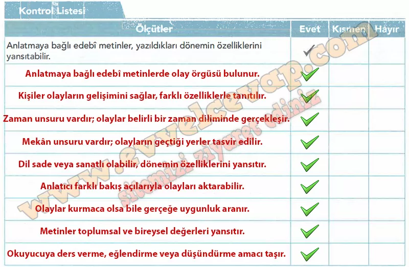

## 10. Sınıf Türk Dili ve Edebiyatı Ders Kitabı Cevapları Meb Yayınları Sayfa 60

**Sıra Sizde**

**Soru: 1) Anlatmaya bağlı edebî metinlerin yazılış amaçlan nelerdir?**

* **Cevap**: Öğretmek, düşündürmek, eğlendirmek, duyguları aktarmak ve hayal gücünü geliştirmek için yazılır.

**Soru: 2) Anlatmaya bağlı edebî metinlerde kullanılan dil ve anlatım özelliklerinin metne katkısı nedir?**

* **Cevap**: Sade, anlaşılır ve akıcı dil metni etkili kılar; betimleyici dil ise okuyucunun hayalinde canlılık oluşturur.

**Soru: 3) Kurmaca ve gerçeklik, anlatmaya bağlı edebî metinleri oluşturan unsurlara nasıl yansıtılmıştır?**

* **Cevap**: Kurmaca unsurlar hayali kahraman ve olaylarla, gerçeklik ise toplumsal değerler ve yaşanmışlıklara dayanan öğelerle yansıtılır.

**Soru: 4) Anlatmaya bağlı edebî metinlerde birden fazla bakış açısının kullanılmasının sebepleri neler olabilir?**

* **Cevap**: Olaylara farklı yönlerden bakabilmek, karakterlerin duygularını daha iyi yansıtmak ve anlatımı zenginleştirmek için birden fazla bakış açısı kullanılır.

**Soru: Sorulara verdiğiniz cevaplardan faydalanarak aşağıdaki Kontrol Listesi’nde anlatmaya bağlı edebî metinlerle ilgili öğrenmelerinize (olay örgüsü, kişiler, zaman, mekân, dil ve anlatım vb.) yönelik ölçütlerinizi belirleyip değerlendirmenizi yapınız.**

**10. Sınıf Meb Yayınları Türk Dili ve Edebiyatı Ders Kitabı Sayfa 60**