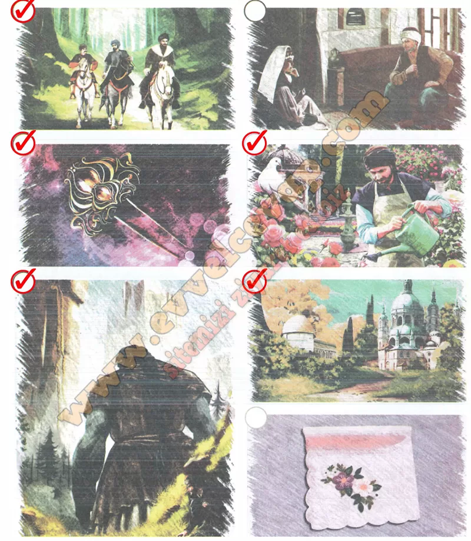

## 10. Sınıf Türk Dili ve Edebiyatı Ders Kitabı Cevapları Meb Yayınları Sayfa 62

**Soru: 3) a) Aşağıdaki görsellerden hangilerinin Mercan Kız masalının içeriğini yansıtabileceğini düşünüyorsunuz? İşaretleyiniz.**

* **Cevap**: 1. görsel (atlılar), 3. görsel (tılsımlı iğne), 5. görsel (dev), 4. görsel (bahçıvan ve güvercin), 6. görsel (saray).

**Soru: b) işaretlediğiniz görselleri seçme nedenlerinizi yazınız.**

* **Cevap**: Çünkü masalda şehzade atla yola çıkar, dev ve tılsımlı iğne vardır. Mercan Kız güvercine dönüşür, bahçıvan onu görür ve olaylar saray çevresinde geçer.

**10. Sınıf Meb Yayınları Türk Dili ve Edebiyatı Ders Kitabı Sayfa 62**