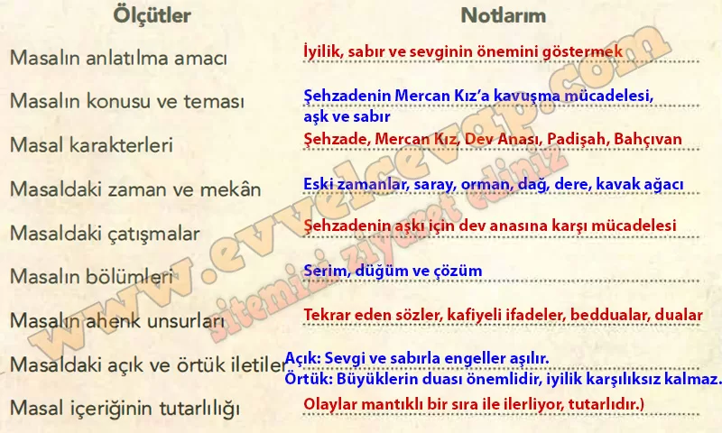

## 10. Sınıf Türk Dili ve Edebiyatı Ders Kitabı Cevapları Meb Yayınları Sayfa 63

**Soru: Aşağıdaki karekodda verilen çok modlu metni dinleyiniz/izleyiniz. Dinleme/izleme sırasında ölçütlerin karşısındaki boşluklara kısa notlar alınız.**

**Soru: Dinleme/izleme sürecinde dijital ortamdan elde ettiğiniz bilgilerin güvenirliğini sorgulayınız.**

* **Cevap**: Dijital ortamda verilen bilgiler kaynağın güvenilir olmasına göre değerlendirilmelidir. Resmî, eğitim amaçlı bir kaynaktan geldiği için güvenilirdir.

**Soru: Aşağıdaki yönergeleri takip ederek çalışmayı yapınız.**

➡️Öğretmeninizin rehberliğinde ikişerli gruplar oluşturunuz.  
 ➡️Aldığınız notlardan faydalanarak grup arkadaşlarınızla birlikte çıkarımlarınızın yer aldığı bir form oluşturunuz.  
 ➡️Formunuzu oluştururken masalın içeriğini ve sunuluş biçimini göz önünde bulundurunuz.  
 ➡️Oluşturduğunuz formları sınıfta sununuz.  
 ➡️Formlardaki çıkarımları değerlendiriniz.  
 ➡️Yaptığınız değerlendirmelerden yola çıkarak formlarınızı yeniden düzenleyiniz.

* **Cevap**: Grup arkadaşımızla masalın konusunu, kahramanlarını, olayların geçtiği yerleri ve masalın iletilerini yazdık. Masalın öğüt verici bir yapısı olduğunu ve olağanüstü unsurlar taşıdığını belirttik. Sunumdan sonra eksiklerimizi fark edip formu daha düzenli ve anlaşılır hale getirdik.

**10. Sınıf Meb Yayınları Türk Dili ve Edebiyatı Ders Kitabı Sayfa 63**